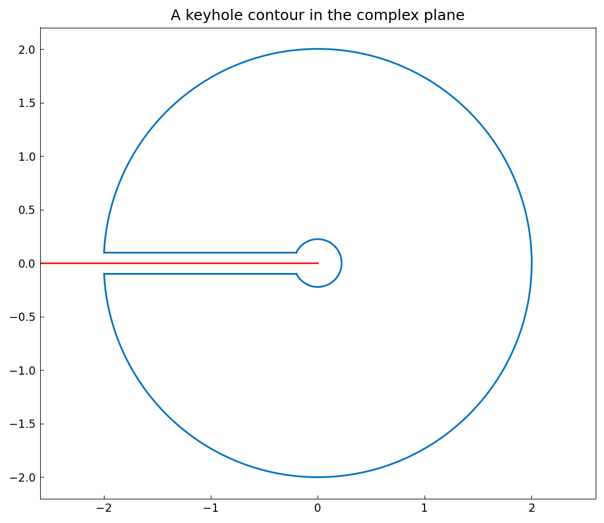

# A keyhole contour integral

*Nick Trefethen and Nick Hale, October 2010*

[Original MATLAB Chebfun example](https://www.chebfun.org/examples/complex/KeyholeContour.html)

(Chebfun example complex/KeyholeContour.m)

Chebfun is able to represent complex functions of a real variable,
which lends itself very well to computing paths and path integrals in
the complex plane.  In this brief example we demonstrate this by
integrating the function

$$ f(x) = \log(x)\tanh(x) $$

around a "keyhole" contour which avoids the branch cut on the negative
real axis.

With $r$, $R$, and $e$ the inner and outer radii and the width of the
key, the contour is built from four pieces — two line segments and two
circular arcs, the arcs parametrized as $c_2\,c_3^s/c_2^s$ with
*separate* principal logarithms, which sends them the long way around
through the positive real axis:

```python
import numpy as np
import jax.numpy as jnp
import chebfunjax as cj

r, R, e = 0.2, 2.0, 0.1
c = [-R+e*1j, -r+e*1j, -r-e*1j, -R-e*1j]
# top: c1 + s(c2-c1);  inner arc: c2 exp(s(Log c3 - Log c2))
# bottom: c3 + s(c4-c3);  outer arc: c4 exp(s(Log c1 - Log c4))
```



Now to integrate around the contour, we parametrise by a real variable
and integrate $f(z(t))\,z'(t)$:

```python
f = lambda z: jnp.log(z)*jnp.tanh(z)
I = sum(cj.chebfun(lambda s: f(z(s))*dz(s), domain=(0.0, 1.0)).sum()
        for z, dz in segments)
```
```
I =
  -0.000000000000001 + 5.674755637702226i
Iexact =
  0.000000000000000 + 5.674755637702224i
error =
     2.782942414004489e-15
```

(The published MATLAB run has error `1.33e-14`; this replica lands even
closer to the exact value $4i\pi\log(\pi/2)$.)

---

*Replicated with [chebfunjax](https://github.com/ma-gilles/chebfunjax); original
example copyright The University of Oxford and The Chebfun Developers.*
