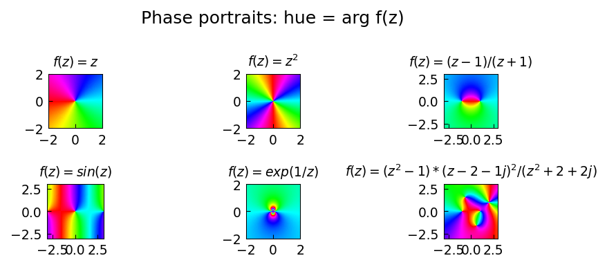

# Phase portraits

**Alex Townsend, March 2013**

[Original MATLAB Chebfun example](https://www.chebfun.org/examples/complex/PhasePortraits.html)

---

A *phase portrait* of a complex function $f(z)$ encodes the argument
$\arg f(z)$ as a colour (hue), with red = 0, through yellow, green, blue,
violet as the argument increases to $2\pi$. Zeros appear as rainbow vortices
(winding number $+1$) and poles as reversed vortices (winding number $-1$).

## Constructing a phase portrait

```python
import numpy as np
import matplotlib.pyplot as plt
import matplotlib.colors as mcolors

def phase_portrait(ax, f, xlim=(-3,3), ylim=(-3,3), n=400, title=""):
    x = np.linspace(xlim[0], xlim[1], n)
    y = np.linspace(ylim[0], ylim[1], n)
    X, Y = np.meshgrid(x, y)
    Z = X + 1j * Y
    W = f(Z)
    H = (np.angle(W) + np.pi) / (2 * np.pi)   # hue in [0,1]
    S = np.ones_like(H)
    V = np.ones_like(H)
    RGB = mcolors.hsv_to_rgb(np.stack([H, S, V], axis=-1))
    ax.imshow(RGB, extent=[*xlim, *ylim], origin='lower', aspect='equal')
    ax.set_title(title)
```

## Examples

```python
fig, axes = plt.subplots(2, 3, figsize=(12, 8))
funcs = [
    (lambda z: z**2,           r"$z^2$"),
    (lambda z: (z-1)/(z+1),    r"$(z-1)/(z+1)$"),
    (lambda z: np.sin(z),      r"$\sin(z)$"),
    (lambda z: np.exp(z),      r"$e^z$"),
    (lambda z: np.tan(z),      r"$\tan(z)$"),
    (lambda z: z*(z-1)*(z+1j), r"$z(z-1)(z+i)$"),
]
for ax, (f, title) in zip(axes.flat, funcs):
    phase_portrait(ax, f, title=title)
```

## Counting zeros and poles

The winding number of the colour wheel around a point equals the order of
the zero (positive) or pole (negative):

```python
# Verify: (z-1)/(z+1) has a zero at z=1 and a pole at z=-1
# Zero at z=1: winding number +1 (one full colour rotation)
# Pole at z=-1: winding number -1 (reversed colour rotation)
```

## Gallery



Phase portraits for $z^2$, $(z-1)/(z+1)$, $\sin z$, $e^z$, $\tan z$, and
$z(z-1)(z+i)$.
