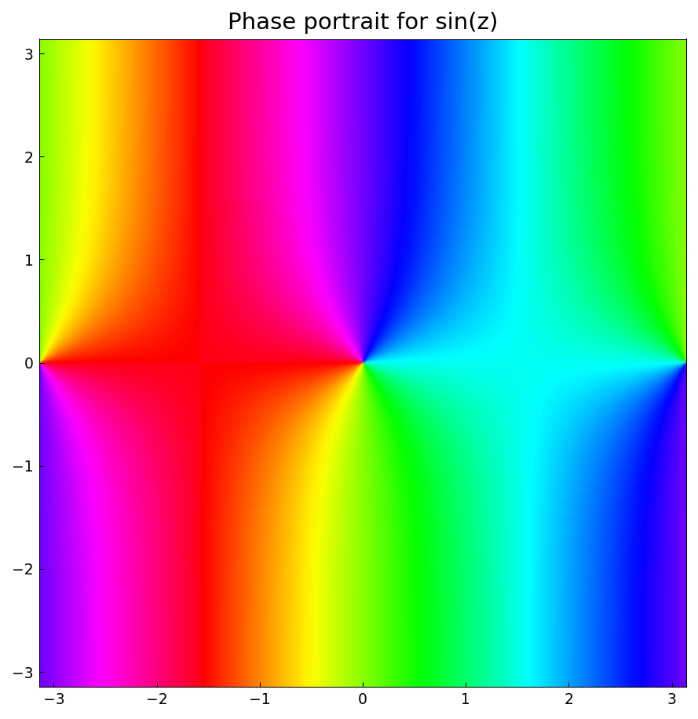
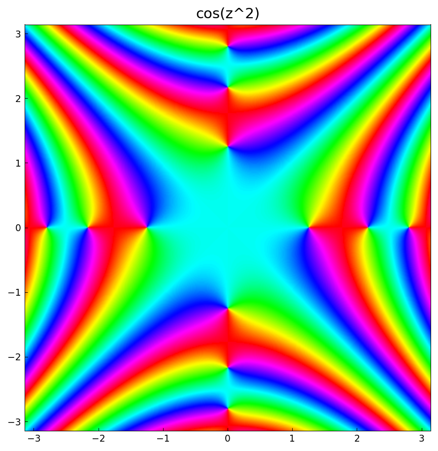
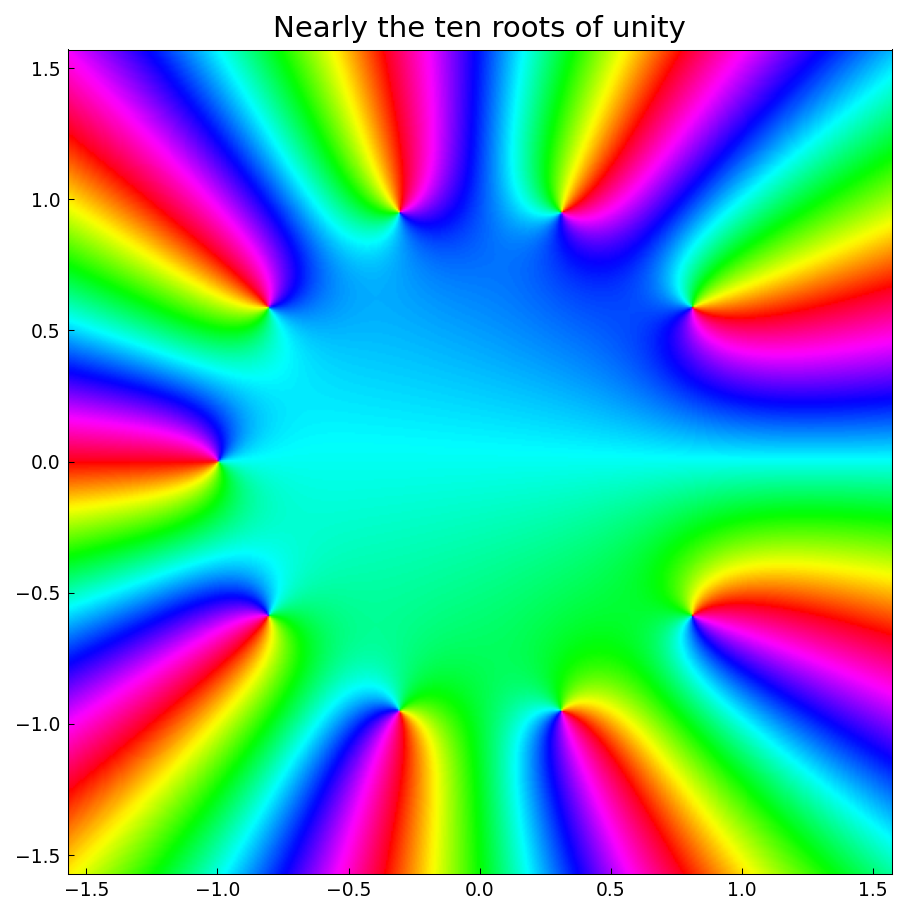
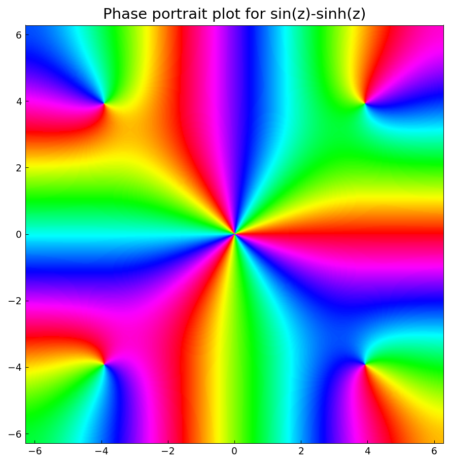

# Phase portraits with chebfun2

*Alex Townsend, March 2013*

[Original MATLAB Chebfun example](https://www.chebfun.org/examples/complex/PhasePortraits.html)

(Chebfun example complex/PhasePortraits.m)

A complex chebfun2 — constructed from a one-argument handle
$f(z)$, $z = x+iy$ — can be rendered as a phase portrait, coloring the
plane by $\arg f$.  For $\sin(z)$ on $[-\pi,\pi]^2$:

```python
import jax.numpy as jnp
import chebfunjax as cj

f = cj.chebfun2(lambda z: jnp.sin(z), domain=(-jnp.pi, jnp.pi,
                                              -jnp.pi, jnp.pi))
```



For $\cos(z^2)$, whose zeros accumulate toward the corners:



The polynomial $1 + z + \cdots + z^9$ has its nine zeros nearly at
roots of unity:



And $\sin(z)-\sinh(z)$, with its symmetric star of zeros:



---

*Replicated with [chebfunjax](https://github.com/ma-gilles/chebfunjax); original
example copyright The University of Oxford and The Chebfun Developers.*
