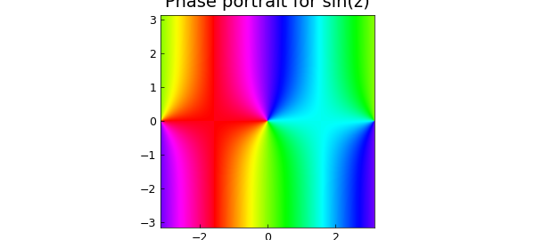
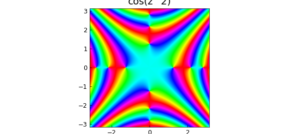
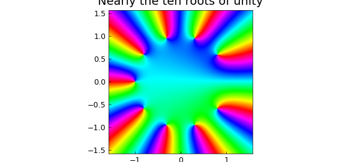
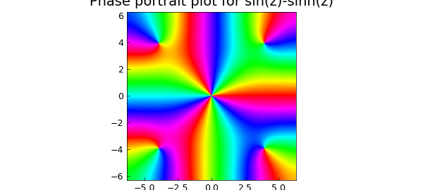

# Phase portraits

*Alex Townsend, March 2013*

[Original MATLAB Chebfun example](https://www.chebfun.org/examples/complex/PhasePortraits.html)

Python translation: [`examples/complex/phase_portraits.py`](https://github.com/ma-gilles/chebfunjax/blob/main/examples/complex/phase_portraits.py)

## Phase portraits for complex functions

Phase portraits are a technique for visualising complex valued functions of a single complex variable. They rely on the visual encoding of complex numbers: if $z = re^{it}$ then the rainbow colours represent the phase of $z$. Red indicates a phase of $0$ and the rainbow goes through red, yellow, green, blue, violet as the phase increases. By default, Chebfun2 produces a phase portrait when asked to plot a chebfun2 object that is complex. For example,

```matlab
FS = 'FontSize'; fs = 14; d = pi*[-1 1 -1 1];
f = chebfun2(@(z) sin(z),d);
plot(f), title('Phase portrait for sin(z)',FS,fs);
```



## One complex variable, two real variables

A complex valued function $f(z)$ of one complex variable can be thought of as a complex valued function of two variables. This is what is going on in the example above.

## Uniqueness

If two complex valued analytic functions $f(z)$ and $g(z)$ have the same phase portrait, then there is a real positive constant c such that $f(z) = cg(z)$. Therefore, one can tell a huge amount about a function $f(z)$ just by considering its phase portrait [1].

## Some more pretty plots

We find these plots addictive to draw. Here are two of our favourites:

```matlab
f = chebfun2(@(z) cos(z.^2), d);
plot(f), title('cos(z^2)',FS,fs)
```



```matlab
g = chebfun2(@(z) sum(z.^(0:9)),d./2,'vectorise');
plot(g), title('Nearly the ten roots of unity',FS,fs)
```



## And one more... just for fun

```matlab
f = chebfun2(@(z) sin(z)-sinh(z),2*d);
plot(f), title('Phase portrait plot for sin(z)-sinh(z)',FS,fs)
```



## Poles and other singularities

As illustrated copiously in [1], the power of phase portraits is most fully realised when they are applied to functions with poles or other singularities. Unfortunately, at present Chebfun2 cannot represent such functions. See, however, the Chebfun example "Phase portraits for functions with poles".

## References

1. E. Wegert, Visual Complex Functions: An Introduction with Phase Portraits, Birkhauser/Springer, Basel, 2012.

---

*Translated with [chebfunjax](https://github.com/ma-gilles/chebfunjax); prose and MATLAB code from the original example, copyright The University of Oxford and The Chebfun Developers.  Printed outputs and figures are chebfunjax's.*
