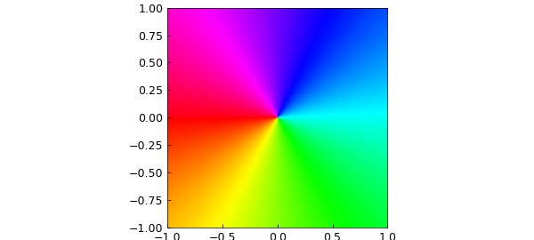
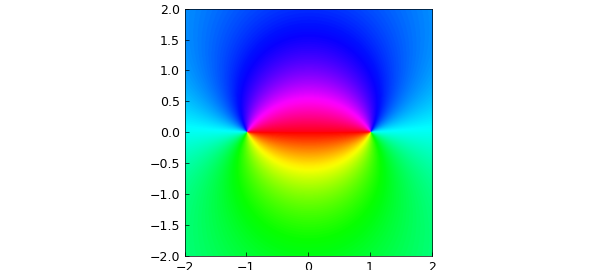
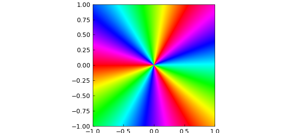
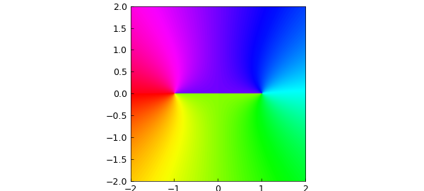
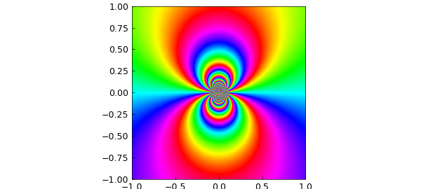
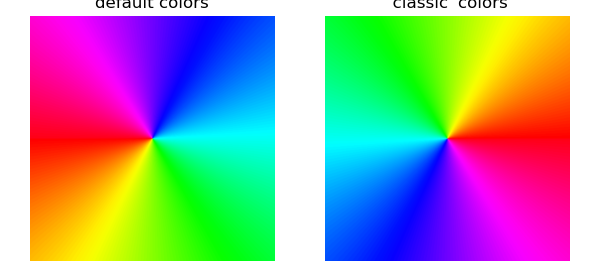

# The phaseplot command

*Nick Trefethen, October 2020*

[Original MATLAB Chebfun example](https://www.chebfun.org/examples/complex/PhaseplotCommand.html)

Python translation: [`examples/complex/phaseplot_command.py`](https://github.com/ma-gilles/chebfunjax/blob/main/examples/complex/phaseplot_command.py)

To plot a complex phase portrait in Chebfun, it is now enough to execute `phaseplot` with a function handle or complex chebfun2. For example, here is a phase portrait of the function $f(z) = z$ on the default domain $[-1, 1, -1, 1]$:

```matlab
phaseplot(@(z) z)
```



At each point $z$ in the domain, the color shows the complex argument of $f(z)$ at that point. For example, if $f(z)$ is positive the color is red and if it is negative the color is cyan. Notice the sequence of six colors as traces around counterclockwise: red, yellow, green, cyan, blue, magenta. One can think of this as an interleaving of the two famous color schemes used by printers: rgb and cmy.

Phase portraits reveal a lot about analytic and meromorphic functions. For example, $f(z) = (z-1)/(z+1)$ has a zero at $z=1$ and a pole at $z=-1$, as revealed by the colors there going in the opposite direction:

```matlab
f = @(z) (z-1)./(z+1);
phaseplot(f, [-2 2 -2 2])
```



Multiple poles or zeros show more colors:

```matlab
f = @(z) z.^3;
phaseplot(f)
```



Branch cuts show up as discontinuities:

```matlab
f = @(z) sqrt(z-1).*sqrt(z+1);
phaseplot(f, [-2 2 -2 2])
```



Essential singularities are glorious:

```matlab
f = @(z) exp(3./z);
phaseplot(f)
```



An earlier phase portrait capability was introduced in Chebfun in 2013, in which `plot(f)` gives a phase portrait if `f` is a chebfun2 that takes complex values. The new `phaseplot` command can also take a chebfun2 as argument, but is is much more flexible since it can deal with any function handle. This broadens the scope greatly since functions with poles and other singularities generally cannot be resolved as chebfun2 objects.

If you compare the images produced by `phaseplot` with the "classic" ones such as those magnificently discussed in [1], you will find a slight difference in coloring.

```matlab
subplot(121), phaseplot(@(z) z)
axis off, title('default colors')
subplot(122), phaseplot(@(z) z, 'classic')
axis off, title('''classic'' colors')
```



The classic color scheme makes cyan, magenta, and yellow much narrower than red, green, and blue. This has some appeal, since the narrow stripes convey sharper information, but on the other hand it seems somewhat artificial to treat three arguments of the compass so differently from the other three. That is why `phaseplot` introduces a slight transformation of the color scheme. In the code it is a one-liner: search for "phi" if you are curious.

To see some amazing things revealed by phase portraits, check out [2].

[1] E. Wegert, *Visual Complex Functions: An Introduction with Phase Portraits*, Birkhäuser, 2012.

[2] E. Wegert, `www.visual.wegert.com`.

---

*Translated with [chebfunjax](https://github.com/ma-gilles/chebfunjax); prose and MATLAB code from the original example, copyright The University of Oxford and The Chebfun Developers.  Printed outputs and figures are chebfunjax's.*
