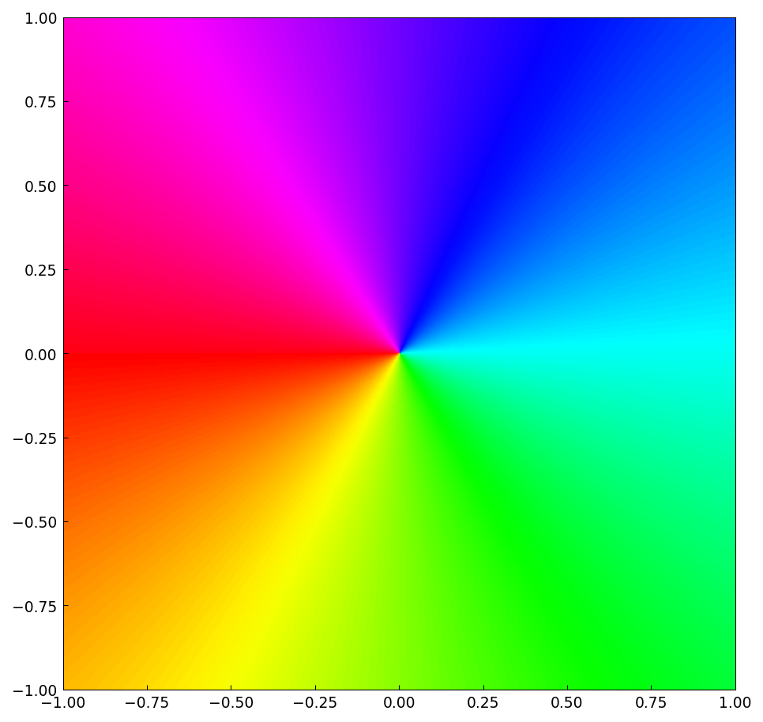
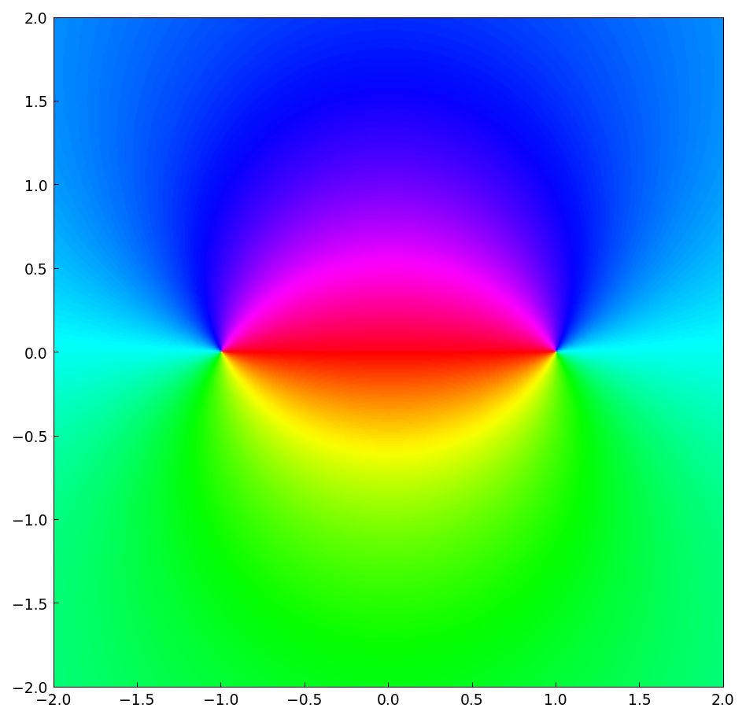
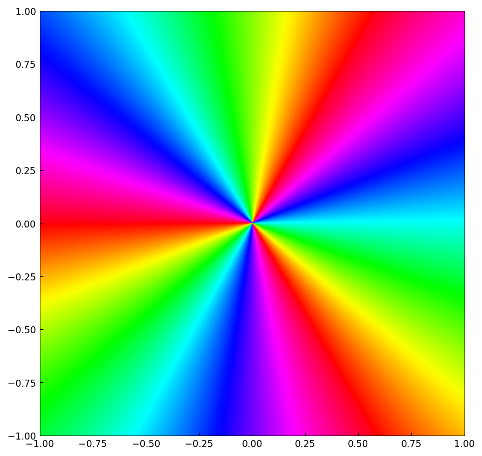
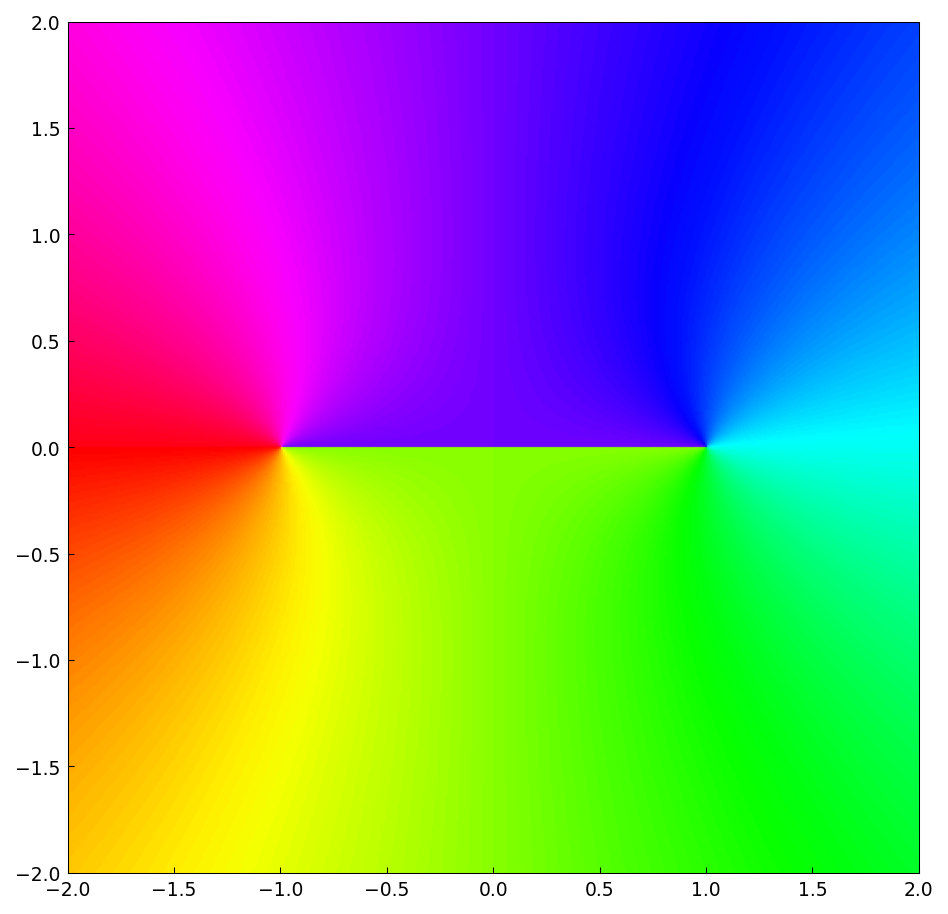
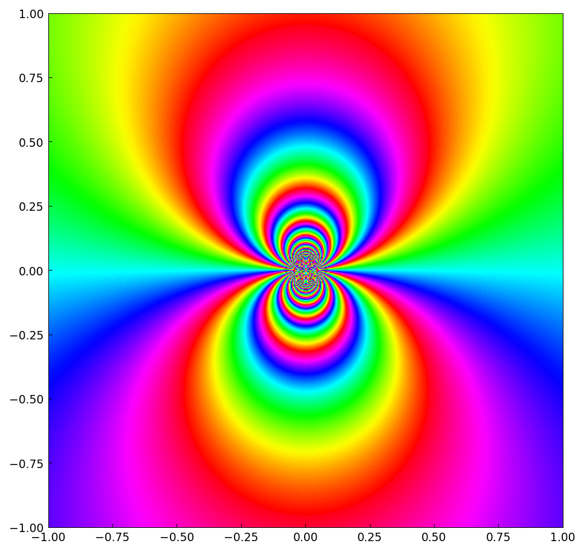
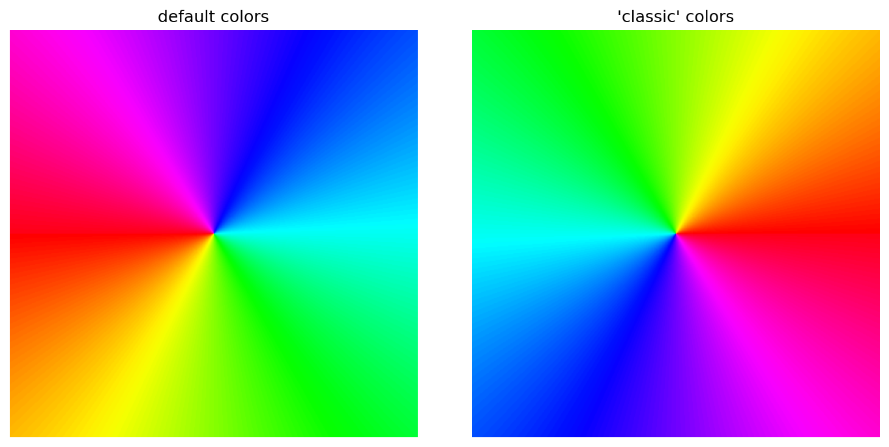

# The phaseplot command

*Nick Trefethen, March 2020*

[Original MATLAB Chebfun example](https://www.chebfun.org/examples/complex/PhaseplotCommand.html)

(Chebfun example complex/PhaseplotCommand.m)

The `phaseplot` command draws a phase portrait directly from a
function handle, with no chebfun2 construction — handy for functions
with poles or branch cuts.  The identity map shows the color wheel:

A Mobius transformation $(z-1)/(z+1)$, with a zero at $1$ and pole at
$-1$:

$z^3$ cycles the colors three times:

$\sqrt{z-1}\sqrt{z+1}$ has branch cuts emanating from $\pm 1$:

And $e^{3/z}$ has an essential singularity at the origin:

Two color conventions are available:

---

*Replicated with [chebfunjax](https://github.com/ma-gilles/chebfunjax); original
example copyright The University of Oxford and The Chebfun Developers.*
