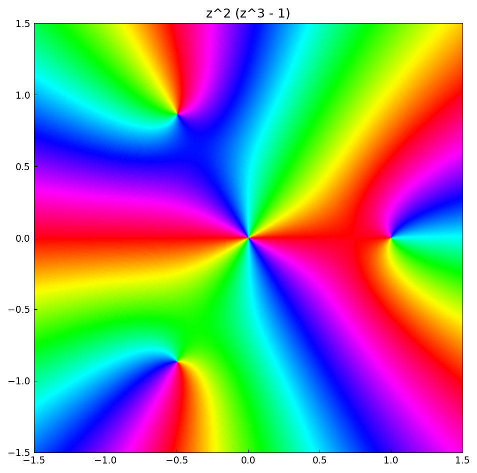
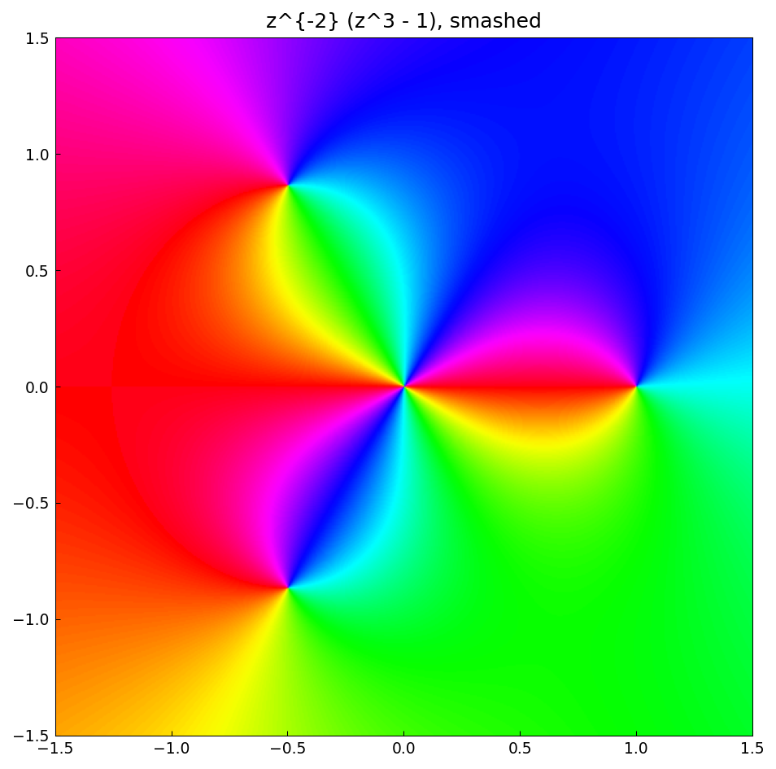
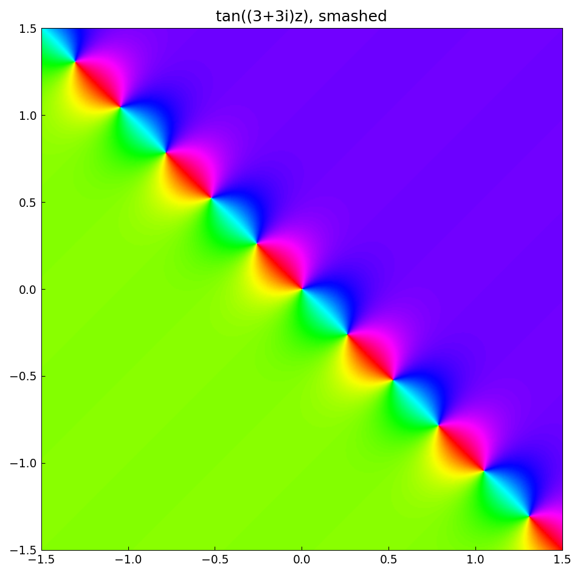

# Phase portraits for functions with poles

*Nick Trefethen, May 2017*

[Original MATLAB Chebfun example](https://www.chebfun.org/examples/complex/PortraitsWithPoles.html)

(Chebfun example complex/PortraitsWithPoles.m)

Here is the phase portrait of $z^2(z^3-1)$ — five zeros, where the
colors circulate counterclockwise (twice around the double zero at the
origin):

A function with poles cannot be represented directly, but the "smash"
transformation $g = f/(1+|f|^2)$ is bounded and has the same phase.
For $z^{-2}(z^3-1)$ the colors circulate *clockwise* around the double
pole at the origin:

And $\tan((3+3i)z)$ has interleaved strings of zeros and poles along a
line at $-45^\circ$:

---

*Replicated with [chebfunjax](https://github.com/ma-gilles/chebfunjax); original
example copyright The University of Oxford and The Chebfun Developers.*
