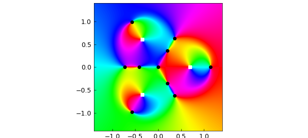
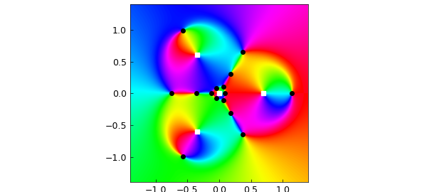

# Zeros of rational harmonic functions

*Olivier Sète, February 2016*

[Original MATLAB Chebfun example](https://www.chebfun.org/examples/complex/RationalHarmonic.html)

Python translation: [`examples/complex/rational_harmonic.py`](https://github.com/ma-gilles/chebfunjax/blob/main/examples/complex/rational_harmonic.py)

```matlab
function RationalHarmonic
```

In astrophysics, the phenomenon of gravitational microlensing describes the bending of light from a light source around massive objects. This can lead to the observation of several images of the source by an observer. This effect can be modeled with rational harmonic functions of the form $f(z) = r(z)-\bar{z}$, where $r$ is a rational function in the complex variable $z$ and $\bar{z}$ is the complex conjugate of $z$. The positions of the observed images correspond to the zeros of $f$.

The maximal possible number of observed images depends on the McMillan degree of the rational function, which is defined as the maximum of the degrees of the numerator and denominator. For degrees $\deg(r) \geq 2$, the maximal possible number of zeros is $5(\deg(r)-1)$ [1], and this bound is sharp. Let us consider the construction of the first examples of functions attaining this bound, which goes back to the astrophysicist Sun Hong Rhie (1955-2013) [3].

The starting point is the rational harmonic funtion $f(z) = r(z) - \bar{z} = \frac{z^{n-1}}{z^n - a^n} - \bar{z}$, where $n \geq 2$ and $a$ are parameters. Let us pick

```matlab
format compact
n = 3;
a = 0.7;
```

We are interested in the zeros of $f$, which we compute with Chebfun2. Since $f$ has poles, we will rewrite the problem to involve finite functions only. The zeros of $f(z) = \frac{p(z)}{q(z)} - \bar{z}$ are the zeros of $p(z) - \bar{z} q(z)$, which can easily be computed in Chebfun2.

```matlab
dom = 1.4 * [-1, 1, -1, 1]; % set up domain
chebfunpref.setDefaults('factory')
z = chebfun2(@(z) z, dom);
p = z.^(n-1);
q = z.^n - a^n;

f_poles = roots(q);
f_zeros = roots(p - q.*conj(z));
```

Let us plot the phase of $f$. Here we cannot replace $f(z)$ by $p(z) - \bar{z} q(z)$, which has a different phase. Instead, we use the function `smash` from the Chebfun example "Phase portraits for functions with poles", which leaves the phase unchanged while removing the poles.

```matlab
function g = smash(f)
    absf = abs(f);
    g = f./(1+absf.^2);     % smooth function with same phase as f
    g(isnan(g)) = 0;        % give 0 rather than NaN at poles
end
```

We also mark the poles by white squares and the zeros by black dots.

```matlab
ff = @(z) z.^(n-1) ./ (z.^n - a^n) - conj(z);
chebfunpref.setDefaults('eps', 1e-8)
f = chebfun2(@(z) smash(ff(z)), dom);

plot(f)
hold on
MFC = 'MarkerFaceColor'; MS = 'MarkerSize'; ms = 3;
plot(real(f_poles), imag(f_poles), 'ws', MFC, 'w', MS, ms)
plot(real(f_zeros), imag(f_zeros), 'ko', MFC, 'k', MS, ms)
hold off
```



Note how the phase portrait differs from that of an analytic function: the phase of the zero at the origin is similar to the phase around a pole! Such zeros are called *sense-reversing*, while the zeros behaving as zeros of analytic functions are called *sense-preserving*. An example is the rightmost zero.

Since $r$ has degree $n = 3$ and $10 = 5(n-1)$ zeros, $f$ has the maximal possible number of zeros. If we repeat the same experiment with $n = 4$, we obtain only 13 zeros, which is not not the maximal possible number of $5(n-1) = 15$ zeros in that case.

To obtain a rational harmonic function of degree $4$ with $15$ zeros, we take again the function $f$ (with $n = 3$), and add a pole at the origin, i.e., we consider the function $f_\varepsilon(z) = f(z) + \frac{\varepsilon}{z}$. This construction was proposed by Rhie [3]. Let us compute its zeros for $\varepsilon = 0.01$. As for $f$, we multiply by the denominator to compute the roots.

```matlab
epsilon = 0.01;
f_eps_poles = roots(q.*z);
f_eps_zeros = roots(p.*z + epsilon*q - q .* z .* conj(z));
```

Now, $f_\varepsilon$ has the maximum possible number of 15 zeros:

```matlab
length(f_eps_zeros)
```

```text
ans =
    15
```

These show nicely in the phase portrait of $f_\varepsilon$, which we produce as before. To speed up the computation, we multiply $f_\varepsilon$ by $|zq(z)|^2$, which does not change the phase but removes the poles.

```matlab
f_eps = chebfun2(@(z) smash((ff(z) + epsilon./z).*(abs(z.*q(z)).^2)), dom);

plot(f_eps)
hold on
plot(real(f_eps_poles), imag(f_eps_poles), 'ws', MFC, 'w', MS, ms)
plot(real(f_eps_zeros), imag(f_eps_zeros), 'ko', MFC, 'k', MS, ms)
hold off
```



The same construction can be done for all $n \geq 3$ and gives rational harmonic functions with the maximal number of zeros. Give it a try! In the construction, the parameter $\varepsilon$ must be chosen sufficiently small, and there are some restrictions on $a$ as well, depending on $n$. All eligible pairs $(a,\varepsilon)$ have been characterized in [2].

## References

1. D. Khavinson, and G. Neumann, "On the number of zeros of certain rational harmonic functions", Proceedings of the American Mathematical Society, 134(4) (2006), 1077-1085.
2. R. Luce, O. Sète, and J. Liesen, "Sharp parameter bounds for certain maximal point lenses", General Relativity and Gravitation, (2014) 46:1736.
3. S. H. Rhie, "n-point gravitational lenses with 5(n-1) images", ArXiv e-prints: astro-ph/0305166v1, (2003).

```matlab
end
```

---

*Translated with [chebfunjax](https://github.com/ma-gilles/chebfunjax); prose and MATLAB code from the original example, copyright The University of Oxford and The Chebfun Developers.  Printed outputs and figures are chebfunjax's.*
