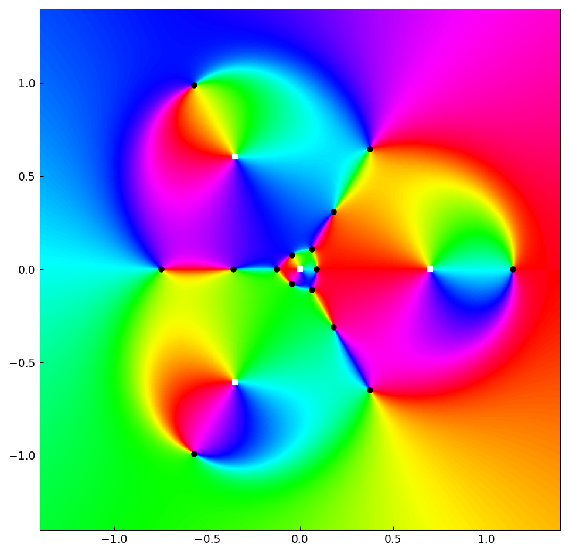

# Zeros of rational harmonic functions

*Olivier Sete, December 2015*

[Original MATLAB Chebfun example](https://www.chebfun.org/examples/complex/RationalHarmonic.html)

(Chebfun example complex/RationalHarmonic.m)

Rational harmonic functions $r(z) - \bar z$ arise in gravitational
lensing: their zeros are the images of a background source lensed by
point masses.  For $r = z^{n-1}/(z^n - a^n)$ with $n=3$, $a=0.7$, the
zeros are found as common roots of the real and imaginary parts using
chebfun2 bivariate rootfinding:

```python
zeros = fre.roots(fim)     # common zeros of Re and Im
```
```
n_zeros = 10  n_poles = 3
```

Ten zeros — the theoretical maximum $5n-5$ for this family (Rhie's
construction).  The phase portrait of the smashed function shows the
zeros (black) and poles (white):


Adding a small point mass $\epsilon/z$ at the origin perturbs the
count:

```
ans =
    15
```

— fifteen zeros, exactly the published value.  Here is the perturbed
portrait:



## References

1. O. Sete, R. Luce, and J. Liesen, Creating images by adding masses
   to gravitational point lenses, _General Relativity and
   Gravitation_, 47 (2015).

---

*Replicated with [chebfunjax](https://github.com/ma-gilles/chebfunjax); original
example copyright The University of Oxford and The Chebfun Developers.*
