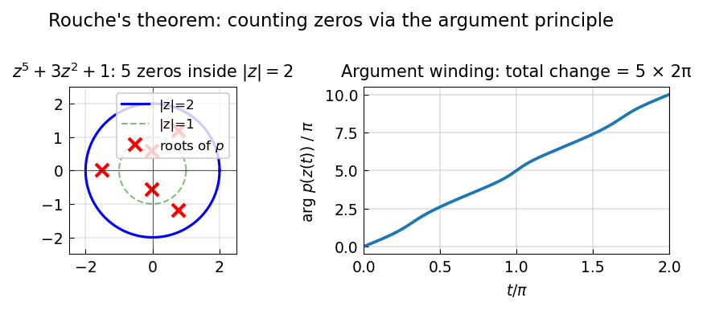

# Rouché's Theorem

**Anthony Austin, November 2012 (revised October 2020)**

[Original MATLAB Chebfun example](https://www.chebfun.org/examples/complex/RoucheTheorem.html)

---

*Rouché's Theorem* states: if $f$ and $g$ are holomorphic in a region bounded
by a simple closed curve $\gamma$, and $|f(z) - g(z)| < |f(z)|$ on $\gamma$,
then $f$ and $g$ have the same number of zeros inside $\gamma$.

## Application: counting roots of a polynomial

How many roots does $p(z) = z^5 + 3z^2 + 1$ have inside $|z| = 2$?

Take $f(z) = z^5$ and $g(z) = 3z^2 + 1$. On $|z| = 2$:

- $|f(z)| = 32$
- $|g(z)| \le 3 \cdot 4 + 1 = 13 < 32$

So $|f - g| = |g| < |f|$ on the circle, and $p = f + g$ has the same number
of zeros as $f(z) = z^5$: exactly **5** zeros inside $|z| = 2$.

## Verification by argument principle

The number of zeros equals $\frac{1}{2\pi i} \oint \frac{p'(z)}{p(z)}\, dz$,
which equals the winding number of $p$ around 0:

```python
import numpy as np

n_pts = 2000
theta = np.linspace(0, 2*np.pi, n_pts, endpoint=False)
z = 2.0 * np.exp(1j * theta)

def p(z):
    return z**5 + 3*z**2 + 1

# Winding number via unwrapped angle
w = p(z)
angles = np.unwrap(np.angle(w))
winding = round((angles[-1] - angles[0]) / (2 * np.pi))
print(f"Winding number (= number of roots inside |z|=2): {winding}")
assert winding == 5
```

## Gallery



*Left*: $p(z)$ on $|z|=2$ mapped into the complex plane — it winds 5 times
around the origin. *Right*: Roots of $p$ in the complex plane.
