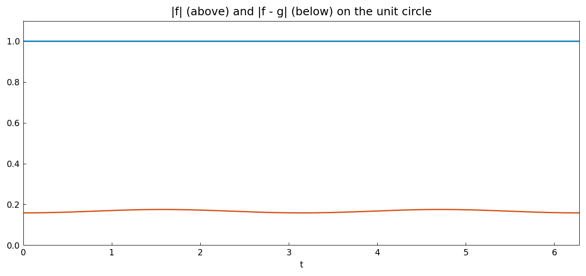
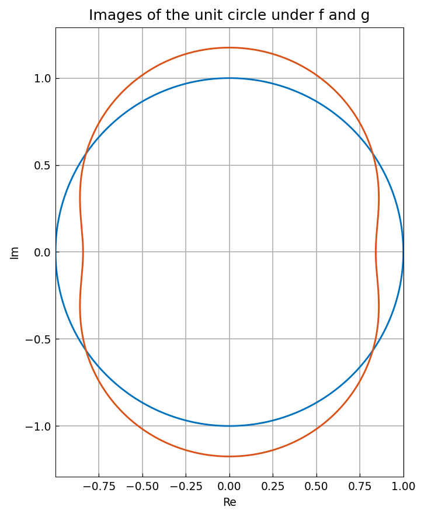
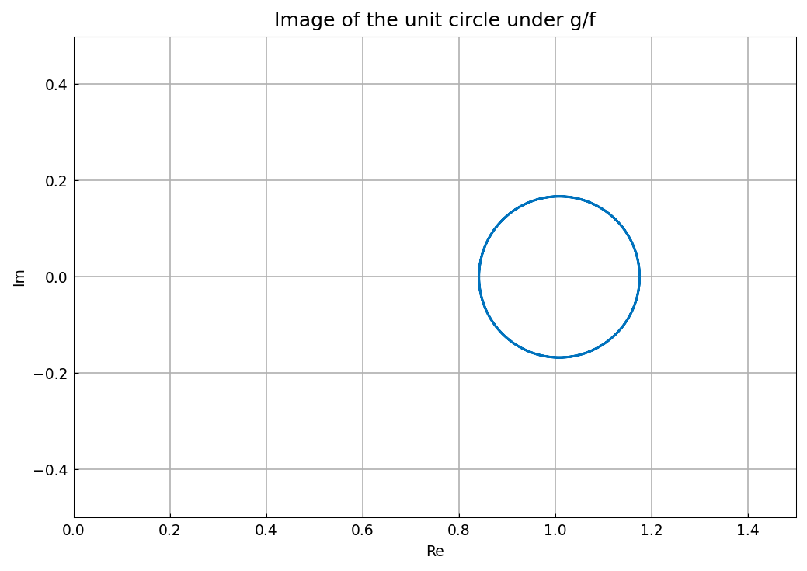
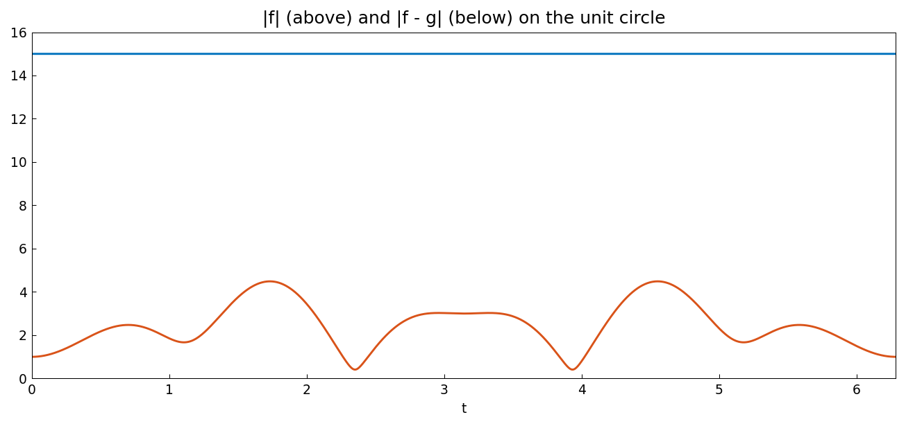
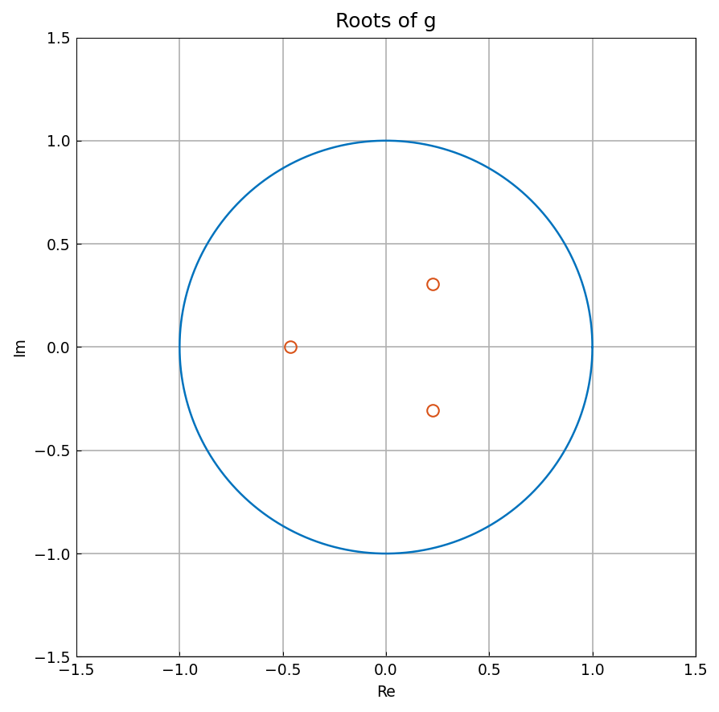
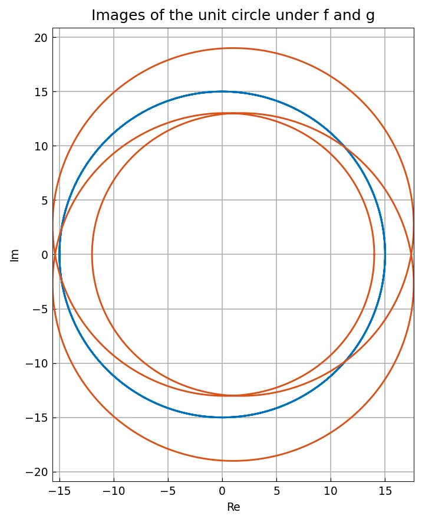

# Rouche's theorem

*Anthony Austin, November 2012*

[Original MATLAB Chebfun example](https://www.chebfun.org/examples/complex/RoucheTheorem.html)

(Chebfun example complex/RoucheTheorem.m)

Rouche's theorem says that if $f$ and $g$ are analytic inside and on a
closed contour and $|f-g| < |f|$ on the contour, then $f$ and $g$ have
the same number of zeros inside.  Take $f(z)=z$ and $g(z)=\sin z$ on
the unit circle; the inequality holds everywhere:



So $\sin z$ has exactly one zero in the unit disk, like $z$.  The
images of the unit circle under $f$ and $g$ wind once around the
origin:



Equivalently, the image of the circle under $g/f$ cannot wind around
the origin, staying in the right half-plane:



Now a polynomial example: $g(z) = z^7-2z^5+15z^3-z+1$ against its
dominant term $f(z)=15z^3$.  The inequality $|f-g|<|f|$ again holds on
the circle:



By Rouche, $g$ has exactly 3 roots in the unit disk — confirmed
directly:



```
roots of g inside the unit circle: 3 (Rouche: 3)
```

The images of the circle under $f$ and $g$ both wind three times
around the origin:



---

*Replicated with [chebfunjax](https://github.com/ma-gilles/chebfunjax); original
example copyright The University of Oxford and The Chebfun Developers.*
