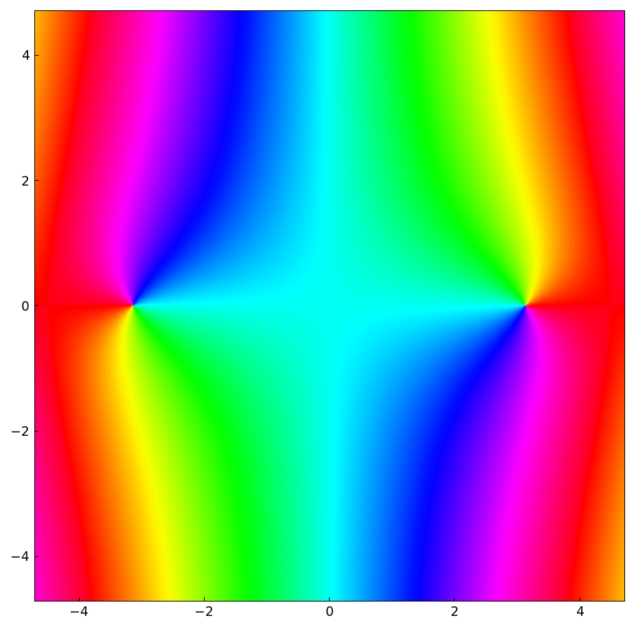
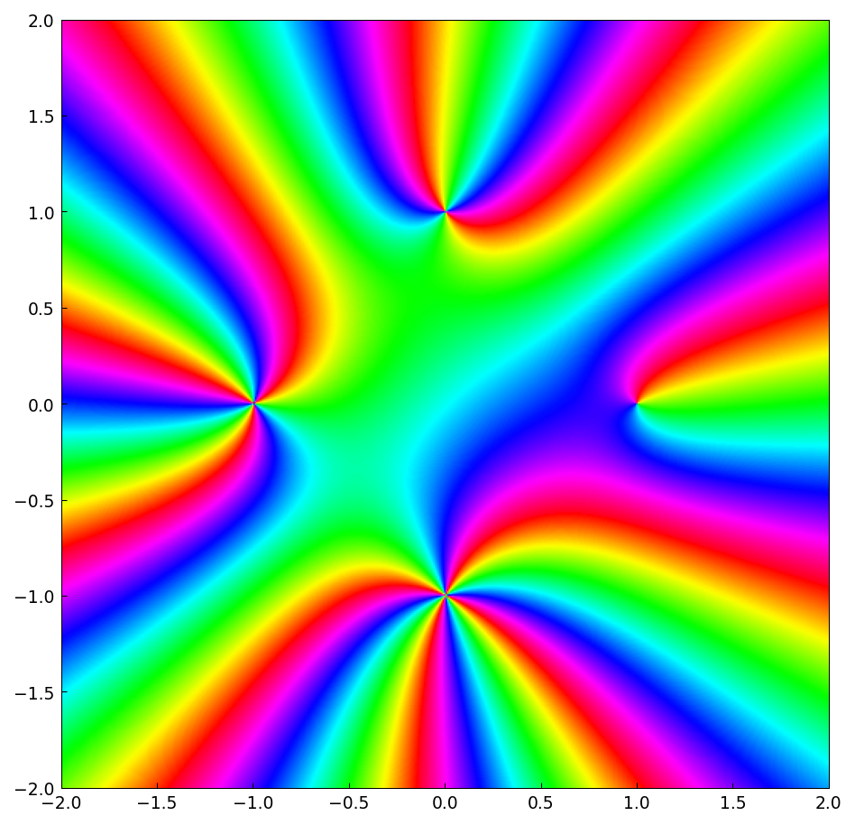
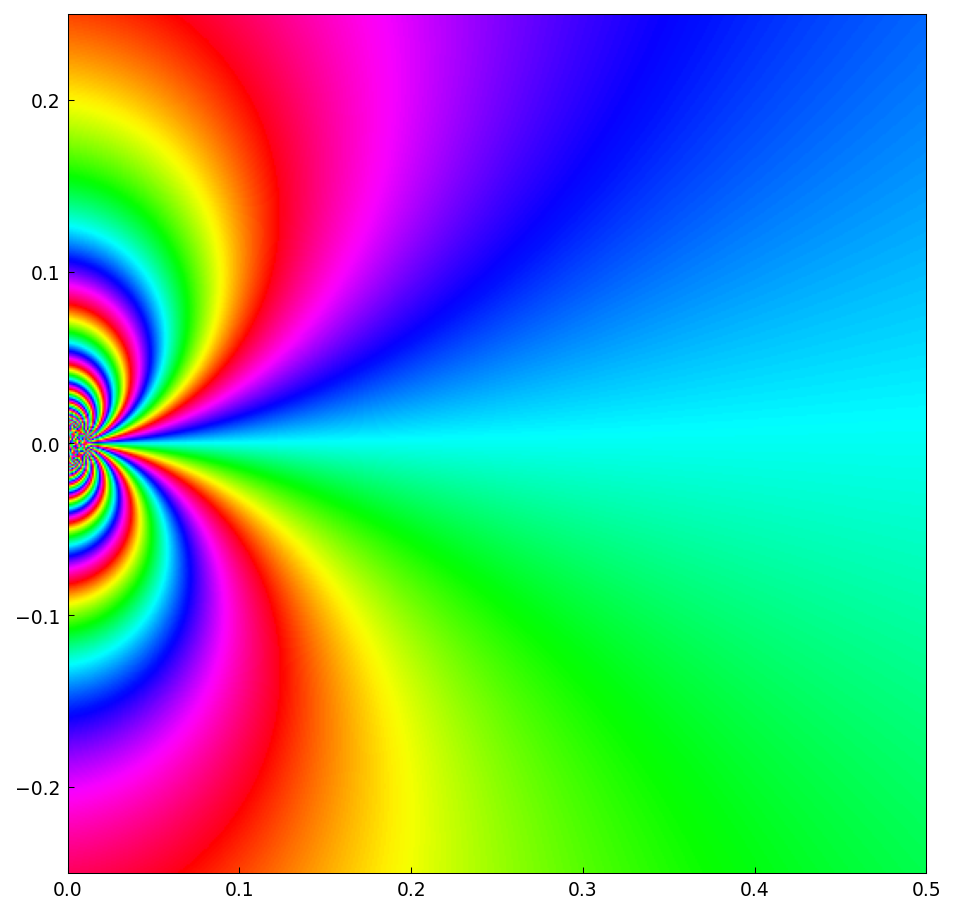

# Phase portraits of singularities

*Nick Trefethen, May 2017*

[Original MATLAB Chebfun example](https://www.chebfun.org/examples/complex/Singularities.html)

(Chebfun example complex/Singularities.m)

Phase portraits color the complex plane by the argument of $f(z)$,
making the type of each singularity visible at a glance.

A *removable* singularity is invisible: $\sin(z)/z$ has a perfectly
smooth portrait (and is representable as a low-rank chebfun2 of the two
real variables — rank 12 here):

*Poles* show as points where the full color cycle wraps $n$ times for a
pole of order $n$.  Here is a function with poles of orders 1, 2, 3, 4
at $1, i, -1, -i$ (rendered via the "smash" trick
$g/(1+|g|^2)$, which has the same phase but stays bounded):

An *essential-type* singularity $e^{-1/z^{0.9}}$ packs infinitely many
oscillations into any neighborhood of the origin:

---

*Replicated with [chebfunjax](https://github.com/ma-gilles/chebfunjax); original
example copyright The University of Oxford and The Chebfun Developers.*
