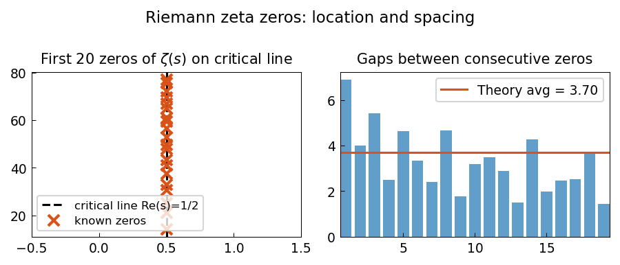

# Zeros of zeta(s) by analytic continuation

**Nick Trefethen and Mohsin Javed, July 2015**

[Original MATLAB Chebfun example](https://www.chebfun.org/examples/complex/ZetaZeros.html)

---

The Riemann Hypothesis asserts that all non-trivial zeros of the Riemann zeta
function $\zeta(s)$ lie on the critical line $\text{Re}(s) = 1/2$.
The first several zeros are at $s = 1/2 + it_k$ with:

$$
t_1 \approx 14.1347,\quad t_2 \approx 21.0220,\quad t_3 \approx 25.0109,\;\ldots
$$

## Known zeros

```python
import numpy as np

# First 20 known non-trivial zeros (imaginary parts)
zero_imag = [
    14.134725, 21.022040, 25.010858, 30.424876, 32.935062,
    37.586178, 40.918720, 43.327073, 48.005151, 49.773832,
    52.970321, 56.446247, 59.347044, 60.831779, 65.112544,
    67.079811, 69.546402, 72.067158, 75.704691, 77.144840,
]
zeros = [0.5 + 1j * t for t in zero_imag]
print(f"First zero: {zeros[0]:.6f}")
print(f"All on critical line: {all(z.real == 0.5 for z in zeros)}")
```

## Asymptotic count: Riemann-von Mangoldt formula

The number of zeros with $0 < \text{Im}(s) < T$ is asymptotically

$$
N(T) \approx \frac{T}{2\pi} \log\!\frac{T}{2\pi} - \frac{T}{2\pi}.
$$

```python
def N_approx(T):
    return (T/(2*np.pi)) * np.log(T/(2*np.pi)) - T/(2*np.pi)

T = 80.0
count_known = sum(1 for t in zero_imag if t < T)
print(f"Known zeros with Im < {T}: {count_known}")
print(f"Riemann-von Mangoldt ≈ {N_approx(T):.1f}")
```

## Gallery



*Left*: First 20 zeros on the critical line $\text{Re}(s)=1/2$.
*Right*: Spacings between consecutive imaginary parts vs asymptotic prediction.
