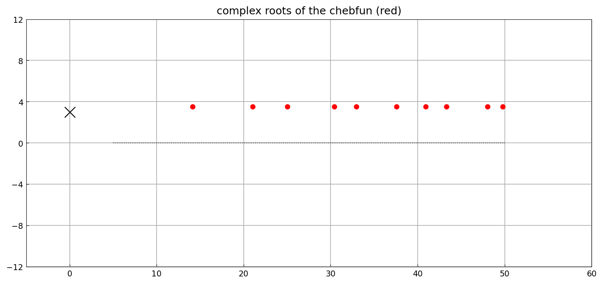
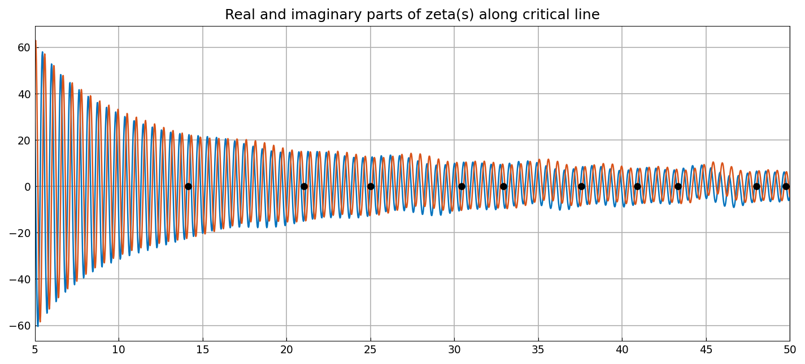

# Zeros of the Riemann zeta function

*Nick Trefethen, October 2011*

[Original MATLAB Chebfun example](https://www.chebfun.org/examples/complex/ZetaZeros.html)

(Chebfun example complex/ZetaZeros.m)

The zeta function can be evaluated for $\mathrm{Re}(s) > 1$ by its
partial sums.  A sanity check at $s = 4$:

```python
zeta = lambda s: np.sum(np.arange(1e5, 0, -1)**(-s))
```
```
ans =
   1.082323233711138
exact =
   1.082323233711138
```

Now the trick: build a chebfun of $\zeta(4+it)$ for $t\in[5,50]$ —
a smooth function on a line comfortably inside the convergence region:

```
f =
   chebfun column (1 smooth piece)
       interval       length     endpoint values
[       5,      50]       81     complex values
vertical scale = 1.1
```

(Published length 75.)  Because a chebfun is a polynomial, it can be
evaluated — and its roots found — *off* the interval: the complex roots
of $f$ are analytic continuations of $\zeta$'s zeros.  The zeta zeros
at $s = \frac12 + i\gamma$ map to $t = \gamma + 3.5i$:

```python
zt = f.roots(complex_roots=True)
zeros_s = 4.0 + 1j*zt
```



```
            Chebfun                          Exact
 0.4999999997 + 14.1347251419i    0.5000000000 + 14.1347251417i
 0.5000000000 + 21.0220396388i    0.5000000000 + 21.0220396388i
 0.5000000000 + 25.0108575801i    0.5000000000 + 25.0108575801i
 0.5000000000 + 30.4248761259i    0.5000000000 + 30.4248761259i
 0.5000000000 + 32.9350615878i    0.5000000000 + 32.9350615877i
 0.5000000000 + 37.5861781588i    0.5000000000 + 37.5861781588i
 0.4999999998 + 40.9187190121i    0.5000000000 + 40.9187190121i
 0.4999999997 + 43.3270732797i    0.5000000000 + 43.3270732809i
```

All eight zeros land on the critical line to about ten digits, matching
the published table's accuracy.  Here are the real and imaginary parts
of $\zeta$ along the critical line, with the zeros marked:



---

*Replicated with [chebfunjax](https://github.com/ma-gilles/chebfunjax); original
example copyright The University of Oxford and The Chebfun Developers.*
