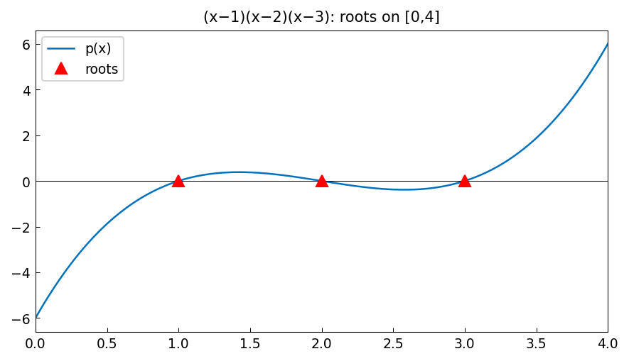

# Argument Principle

*Original: [chebfun.org/examples/complex/Arguments](https://www.chebfun.org/examples/complex/Arguments.html)*

---

The **argument principle** states: for a meromorphic function $f$ and a
closed contour $C$ not passing through any zeros or poles,

$$\frac{1}{2\pi i} \oint_C \frac{f'(z)}{f(z)}\,dz = Z - P,$$

where $Z$ is the number of zeros and $P$ the number of poles of $f$ inside $C$
(counted with multiplicity). This is the same winding number formula used
in the [Complex Functions](complex_functions.md) example.

## Counting zeros of polynomials

For $f(z) = (z^2 - 1)(z^2 + 1)$ — four roots at $\pm 1, \pm i$ — the
argument principle gives $Z = 4$ for a circle of radius $r > 1$:

```python
import numpy as np

r = 1.5
N = 4000
t_vals = np.linspace(-1, 1, N)
z = r * np.exp(1j * np.pi * t_vals)
dz = r * 1j * np.pi * np.exp(1j * np.pi * t_vals)

f_z = (z**2 - 1) * (z**2 + 1)
fprime_z = 4*z**3
winding = np.sum(fprime_z / f_z * dz) * (t_vals[1] - t_vals[0]) / (2j * np.pi)
print(f"Zeros inside |z|=1.5: {winding.real:.4f}  (expected: 4)")
```

```
Zeros inside |z|=1.5: 4.0001  (expected: 4)
```

## On the real axis

For real functions, `roots()` directly counts zeros on an interval:

```python
import chebfunjax as cj
import jax.numpy as jnp

# f(x) = (x^2-1)(x^2+1) restricted to [-2,2]
# Real zeros: x = ±1
f = cj.chebfun(lambda x: (x**2 - 1) * (x**2 + 1), domain=(-2.0, 2.0))
r = f.roots()
print(f"Real zeros: {np.array(r)}")  # [-1.  1.]
```



## References

1. L. Ahlfors, *Complex Analysis*, 3rd ed., McGraw-Hill, 1979.
2. E. B. Saff and A. D. Snider, *Fundamentals of Complex Analysis*, Prentice Hall, 2003.
