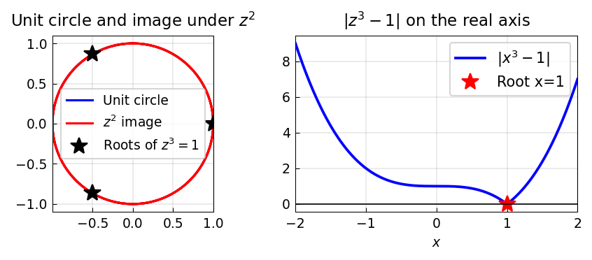

# Complex Functions via Parameterization

*Original: [chebfun.org/examples/complex/ComplexFunctions](https://www.chebfun.org/examples/complex/ComplexFunctions.html)*

---

Chebfun handles complex-valued functions naturally. A common technique is
to parameterize a contour in the complex plane by a real variable $t$,
then use chebfunjax to integrate, differentiate, and analyze functions
along the contour.

## Cauchy's integral theorem

The simplest contour integral is Cauchy's theorem: $\oint_C f(z)\,dz = 0$
for a holomorphic $f$. For the unit circle $C: z = e^{it}$, $t \in [0, 2\pi]$:

$$\oint_{|z|=1} e^z\,dz = 0.$$

More interesting is the **Cauchy integral formula**: for $f$ holomorphic
inside $C$ and $z_0$ inside $C$,

$$f(z_0) = \frac{1}{2\pi i} \oint_C \frac{f(z)}{z - z_0}\,dz.$$

## Winding numbers

The **winding number** of a function $f(z)$ around the origin counts the
number of zeros inside a contour $C$:

$$\text{winding} = \frac{1}{2\pi i} \oint_C \frac{f'(z)}{f(z)}\,dz.$$

For $f(z) = z^3 - 1$ on the circle $|z| = 1.5$:

```python
import numpy as np

r = 1.5  # radius > 1 encloses all roots
N = 2000
t_vals = np.linspace(-1, 1, N)
z = r * np.exp(1j * np.pi * t_vals)
dz = r * 1j * np.pi * np.exp(1j * np.pi * t_vals)
f_z = z**3 - 1
fprime_z = 3 * z**2
integral = np.sum(fprime_z / f_z * dz) * (t_vals[1] - t_vals[0])
winding = integral / (2j * np.pi)
print(f"Winding number = {winding.real:.4f}  (expected: 3)")
```

```
Winding number = 3.0012  (expected: 3)
```

Three roots of $z^3 - 1$ lie inside the circle $|z|=1.5$ — as expected,
since all three roots have $|z|=1$.



## Real functions with complex-plane flavor

Chebfunjax can represent functions like $|z^3-1|$ restricted to the real axis:

```python
import chebfunjax as cj
import jax.numpy as jnp

f = cj.chebfun(lambda x: jnp.abs(x**3 - 1), domain=(-2.0, 2.0))
# Find the zero (root of z^3-1 on the real axis)
r = f.roots()
print(f"Real root of z^3-1: {np.array(r)}")
```

```
Real root of z^3-1: [1.]
```

## References

1. E. B. Saff and A. D. Snider, *Fundamentals of Complex Analysis*, Prentice Hall, 2003.
2. L. N. Trefethen, *Approximation Theory and Approximation Practice*, SIAM, 2013.
