# Eigenfunctions of the Laplacian on the disk

*Heather Wilber, January 2017*

[Original MATLAB Chebfun example](https://www.chebfun.org/examples/disk/Eigenfunctions.html)

(Chebfun example disk/Eigenfunctions.m)

The eigenfunctions of the Laplacian on the unit disk with Dirichlet
boundary conditions are the cylindrical harmonics
$u_{m,n}(\theta, r) = J_m(\lambda_{m,n} r) e^{im\theta}$, where
$\lambda_{m,n}$ is the $n$th positive root of the Bessel function
$J_m$.  They are available through `Diskfun.harmonic`:

```python
import jax.numpy as jnp
import numpy as np
from scipy.special import jv
import chebfunjax as cj
from chebfunjax.diskfun.diskfun import Diskfun

u42 = Diskfun.harmonic(4, 2)
```
```
u42 =
Diskfun(rank=1, n_plus=1, n_minus=0)
```

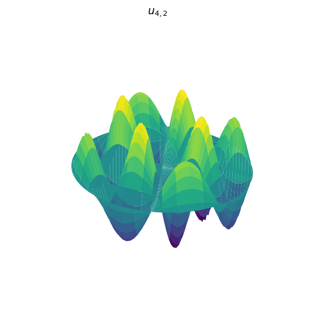

We can verify the eigenfunction property numerically:
$\nabla^2 u_{4,2} + \lambda_{4,2}^2 u_{4,2}$ is numerically zero:

```python
lam = cj.chebfun(lambda x: jnp.asarray(jv(4, np.asarray(x))),
                 domain=[10, 13]).roots()[0]
resid = u42.lap() + u42 * lam**2
```
```
ans =
     1.610930117737086e-10
```

Here is a gallery of harmonics: the radially symmetric modes
$u_{0,n}$, some modes with angular oscillation, and a high-order one:

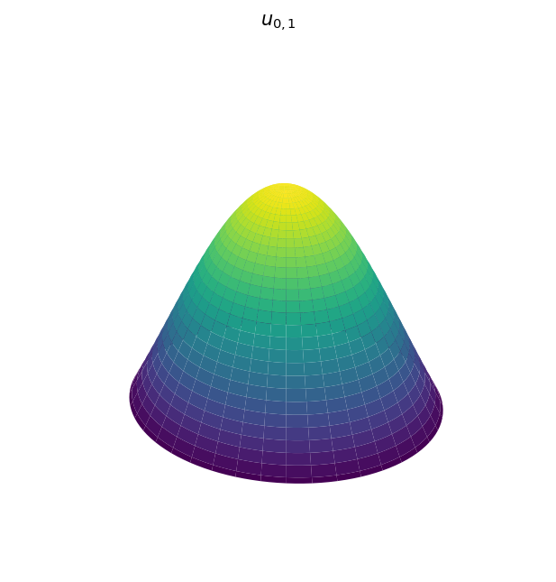
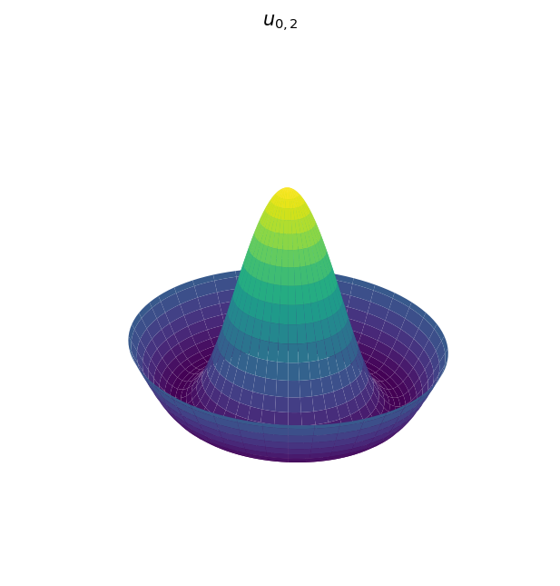
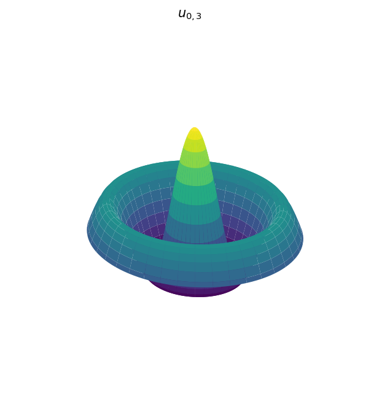
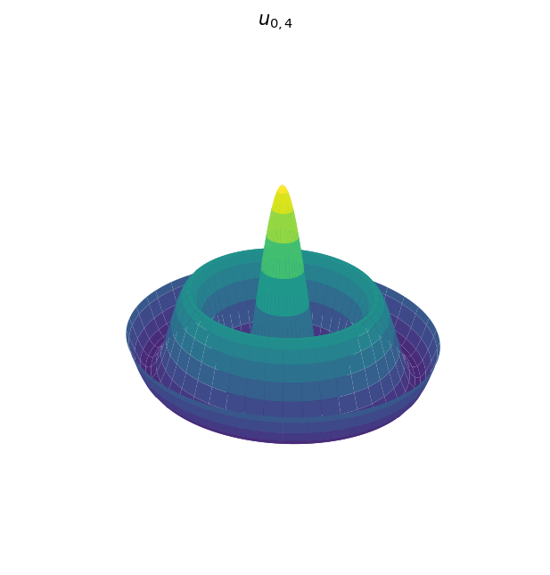
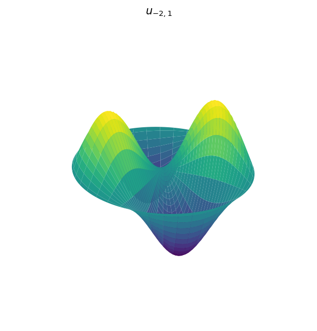
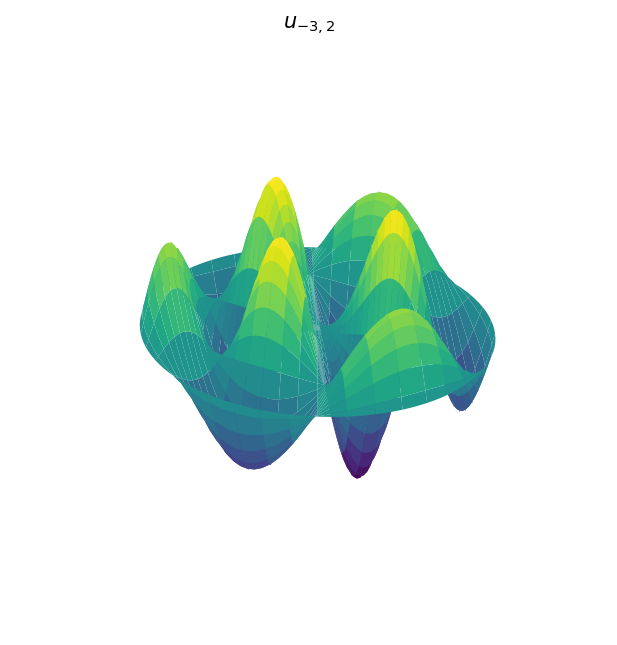
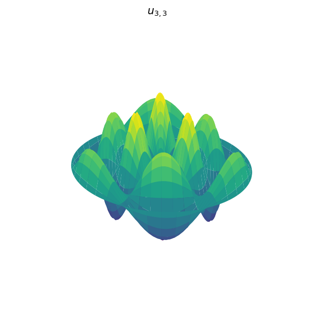
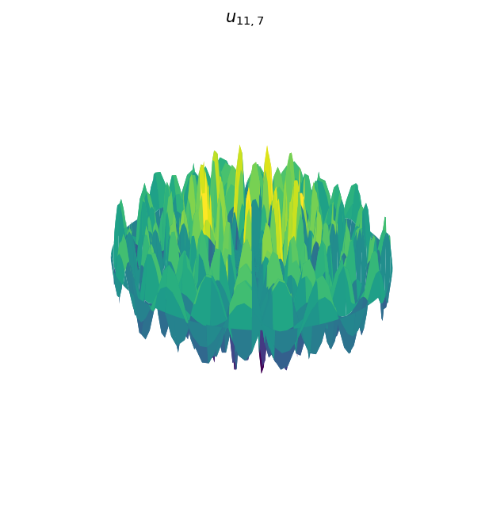

Neumann variants are also available:

```python
uN21 = Diskfun.harmonic(2, 1, "neumann")
uN34 = Diskfun.harmonic(3, 4, "neumann")
```

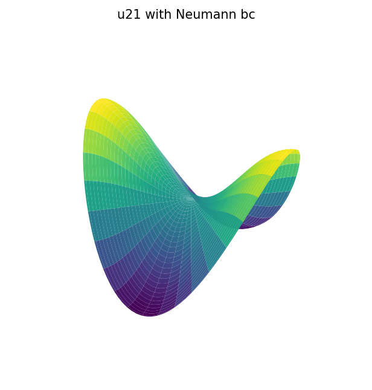
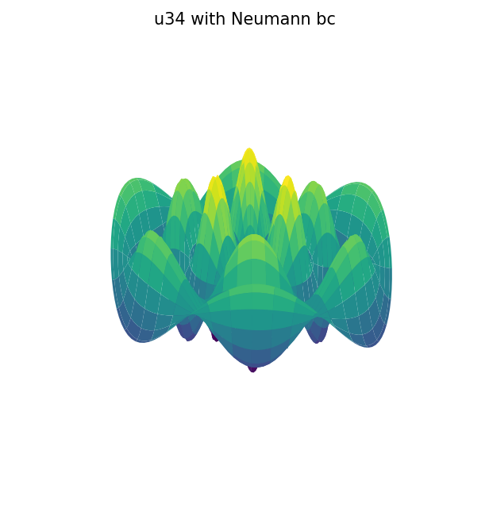

The harmonics are orthonormal in $L^2$ on the disk:

```python
int1 = (u01 * u02).sum2()
int2 = (v22 * u117).sum2()
int3 = (u03 * u03).sum2()
```
```
int1 =
     -1.840701997332679e-16
int2 =
    -7.049304784949971e-17
int3 =
   1.000000000000001
```

## Eigenfunction expansions

Any smooth function on the disk can be expanded in the harmonics.  We
compute the first $105$ coefficients of a Gaussian-bump function by
projection and display their magnitudes:

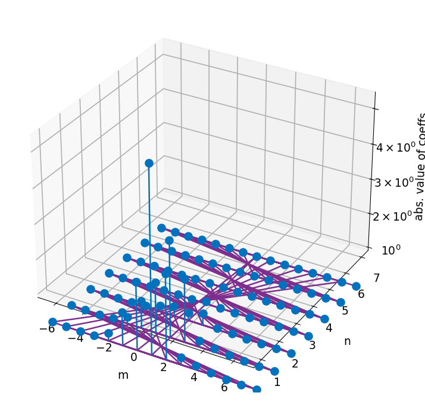

Truncating to $|m|, n < 6$ and summing gives a projection whose error
is dominated by the discarded modes:

```python
errf = norm(f - fproj)
```
```
errf =
   0.003130282187232
```

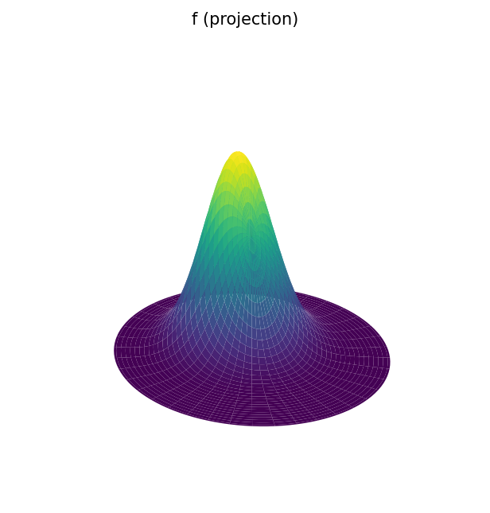
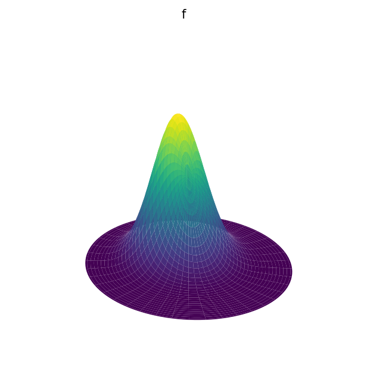
