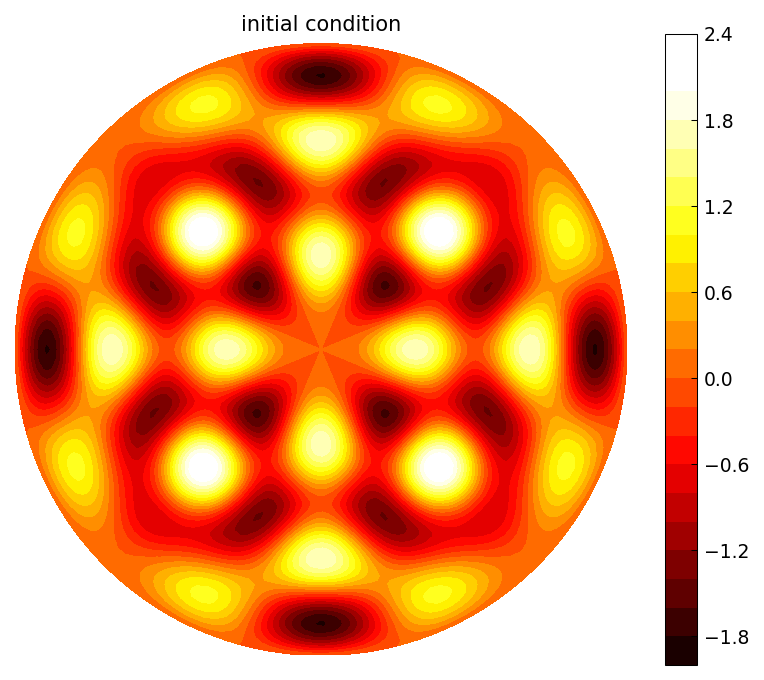
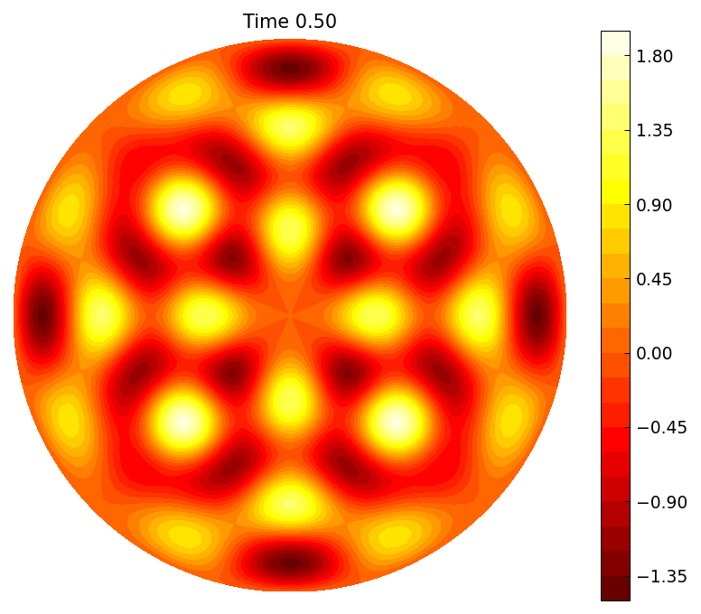
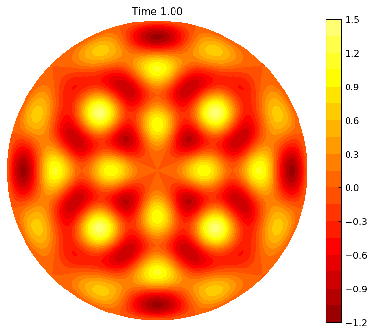
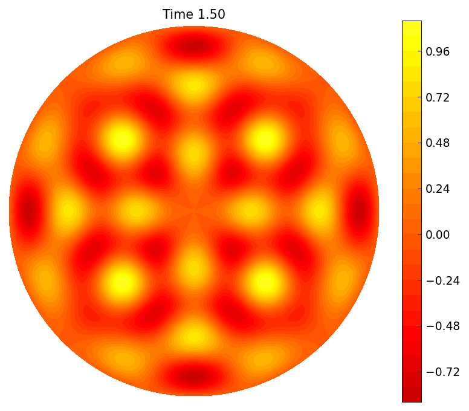
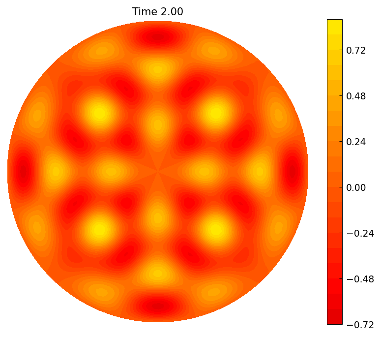

# The heat equation on the unit disk

*Heather Wilber, January 2017*

[Original MATLAB Chebfun example](https://www.chebfun.org/examples/disk/HeatEqn.html)

(Chebfun example disk/HeatEqn.m)

The heat equation $u_t = \alpha \nabla^2 u$ on the unit disk can be
integrated in time with BDF formulas: each step is a Helmholtz solve
with imaginary wavenumber $K$, i.e. a screened Poisson equation.  We
start with an initial condition built from two cylindrical harmonics,
whose exact evolution is known:

```python
import jax.numpy as jnp
import numpy as np
from scipy.special import jv
import chebfunjax as cj
from chebfunjax.diskfun.diskfun import Diskfun

u0 = Diskfun.harmonic(8, 2) + Diskfun.harmonic(4, 4)
```



The decay rates are set by the Bessel roots
$\lambda_{8,2} \approx 16.038$ and $\lambda_{4,4} \approx 17.616$;
choosing $\alpha = 1/(\lambda_1^2 + \lambda_2^2)$ gives a pleasant
timescale.  A first BDF1 step bootstraps BDF2:

```python
lam1 = float(cj.chebfun(lambda x: jnp.asarray(jv(8, np.asarray(x))),
                        domain=[15, 17]).roots()[0])
lam2 = float(cj.chebfun(lambda x: jnp.asarray(jv(4, np.asarray(x))),
                        domain=[16, 18]).roots()[0])
alpha = 1 / (lam1**2 + lam2**2)
dt, tfinal, m = 0.01, 2.0, 20
K = np.sqrt(1 / (dt * alpha)) * 1j
u = Diskfun.helmholtz(u0 * K**2, K, lambda t: 0*t, m, m)
K = np.sqrt(3 / (2 * dt * alpha)) * 1j
for n in range(2, int(tfinal / dt) + 1):
    rhs = (4 * u - up) * K**2 / 3
    up, u = u, Diskfun.helmholtz(rhs, K, lambda t: 0*t, m, m)
```









Since the initial condition is a sum of Laplacian eigenfunctions, the
exact solution is known, and the error at $t = 2$ measures the BDF2
time discretization:

```
ans =
     5.496308595583096e-06
```

(The published run shows 5.375e-06 — the same $O(\Delta t^2)$
discretization-error magnitude.)

## A steady state with Dirichlet data

Placing Gaussian bumps on the disk, taking the boundary trace
$g(\theta)$ as fixed Dirichlet data, and running the flow to steady
state gives the harmonic extension of $g$, computed directly with the
Poisson solver:

```python
u = Diskfun.poisson(zero, g, 128)
```
```
u =
Diskfun(rank=31, n_plus=16, n_minus=15)
mxu =
  30.036677407856786   1.570010535735969
mxg =
  30.036677407857276   1.570857463287587
```

By the maximum principle, the steady-state maximum equals the maximum
of the boundary data — matched here to twelve digits, both attained at
$\theta = \pi/2$.
