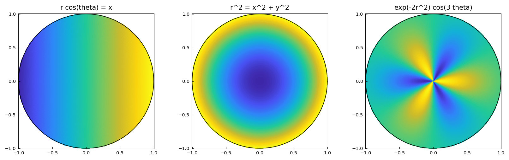

# Disk Function Examples (Diskfun)

Diskfun represents smooth functions on the unit disk `{(x,y): x²+y² ≤ 1}`
using a Chebyshev-Fourier series in polar coordinates `(r, θ)`.

---

## Functions on the unit disk

**Source:** `disk/Eigenfunctions.m`, `disk/HeatEqn.m`

```python
import jax.numpy as jnp
import chebfunjax as cj

# x-coordinate on the disk: rank 1
f = cj.diskfun(lambda x, y: x)
print(f.rank)           # 1

# Integral of x over disk = 0 (odd function)
print(f.sum2())         # ~0

# r^2 = x^2 + y^2: integral over disk = pi/2
g = cj.diskfun(lambda x, y: x**2 + y**2)
print(g.sum2())         # pi/2 ≈ 1.5708
```



---

## Key facts

- `∫∫_D 1 dA = π` (area of unit disk)
- `∫∫_D r² dA = π/2`
- `∫∫_D x dA = 0`, `∫∫_D y dA = 0` (odd functions)
- Eigenfunctions of the Laplacian on the disk are `J_m(ρ_{mn} r) e^{imθ}`
  where `ρ_{mn}` are zeros of Bessel functions.

*No examples yet.*

*No examples yet.*

*No examples yet.*
