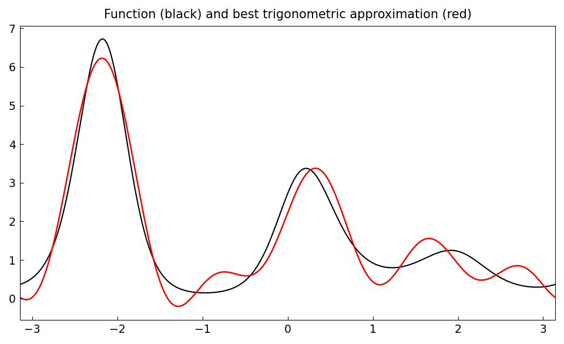
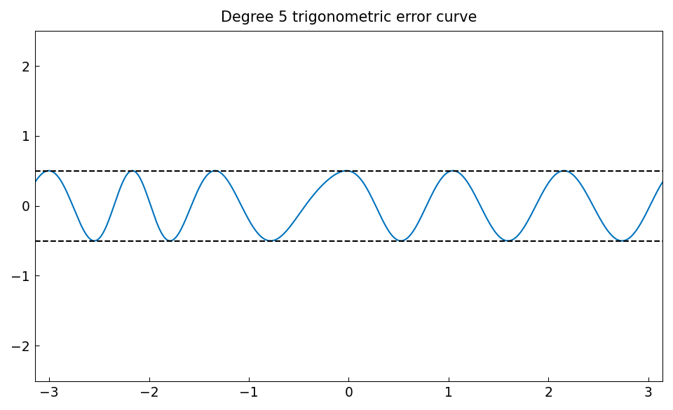
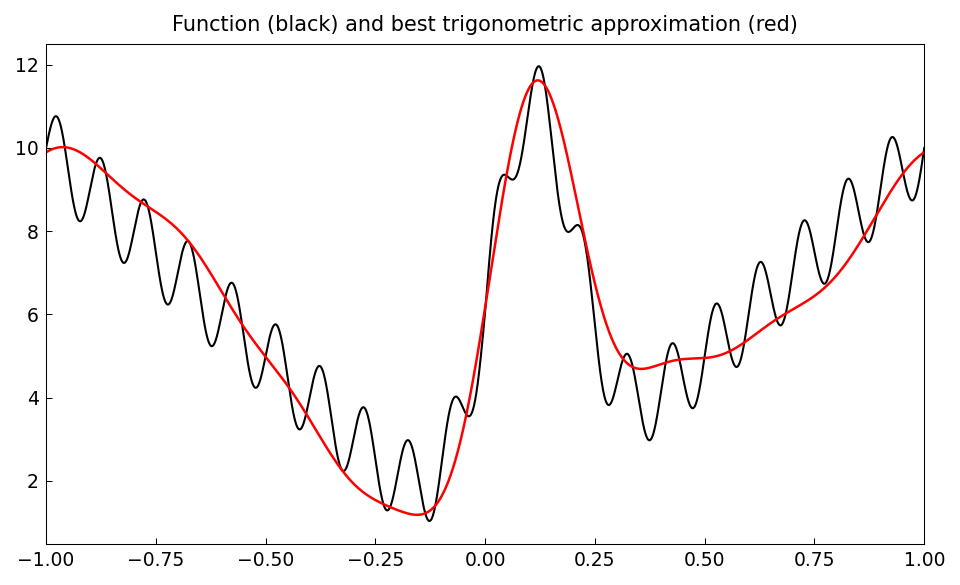
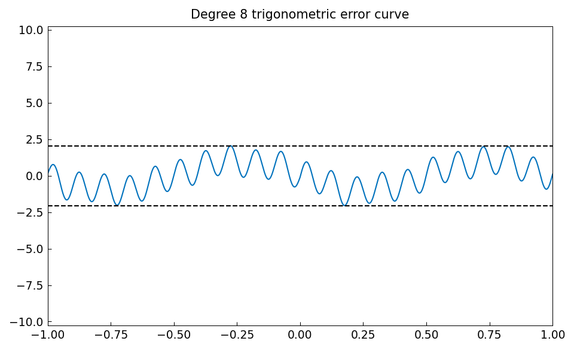
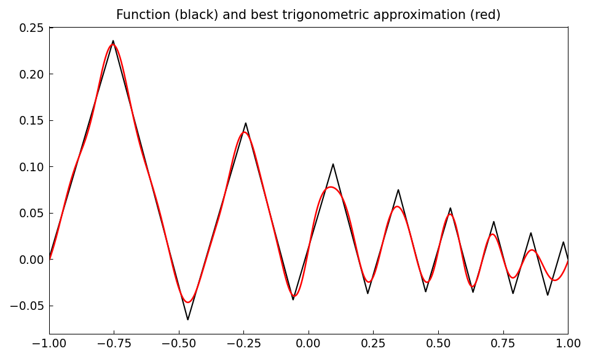
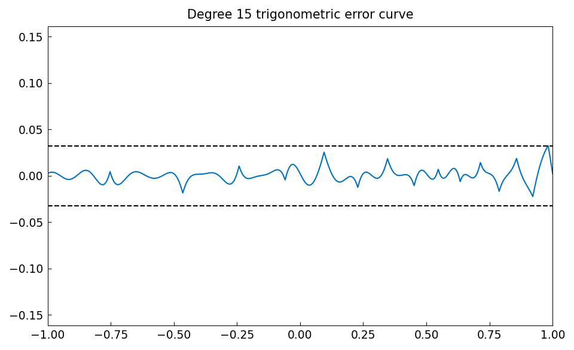

# Best trigonometric approximation with trigremez

*Mohsin Javed and Nick Trefethen, February 2015*

[Original MATLAB Chebfun example](https://www.chebfun.org/examples/fourier/BestTrigApprox.html)

(Chebfun example fourier/BestTrigApprox.m)

The `trigremez` command computes best (minimax) trigonometric
approximations of periodic functions.  Here is a smooth periodic
function and its best degree-5 trigonometric approximation:

```python
import jax.numpy as jnp
import numpy as np
import chebfunjax as cj

f = cj.chebfun(lambda x: jnp.exp(jnp.sin(2 * x) + jnp.cos(3 * x)),
               domain=[-np.pi, np.pi], trig=True)
p, err, *_ = cj.trigremez(f, 5)
```



The hallmark of best minimax approximation is the equioscillating error
curve — for trigonometric degree $n$ the error attains its extreme
magnitude at least $2n+2$ times:



The function being approximated need not be smooth — `trigremez` only
requires it to be continuous with a little smoothness.  Here is a spiky
non-smooth example, approximated to degree 8:

```python
fh = lambda x: (10 * jnp.abs(x) + jnp.sin(20 * np.pi * x)
                + 10 * jnp.exp(-50 * (x - 0.1) ** 2))
f = cj.chebfun(fh, splitting=True)
p, err, *_ = cj.trigremez(f, 8)
```





Finally, a piecewise-smooth function built as the indefinite integral
of a square-wave-like sign function, detrended to be periodic, and its
best degree-15 approximation:

```python
g = cj.chebfun(lambda x: jnp.sign(jnp.sin(20 * jnp.exp(x))),
               splitting=True).cumsum()
x = cj.chebfun(lambda t: t)
m = (g(1) - g(-1)) / 2
f = g - (m * (x - 1) + g(1))
p, err, *_ = cj.trigremez(f, 15)
```




