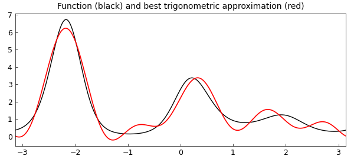
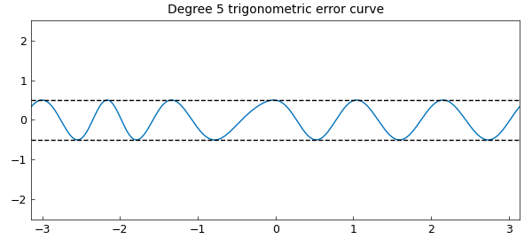
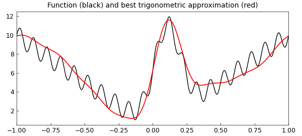
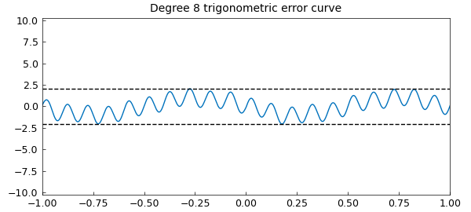
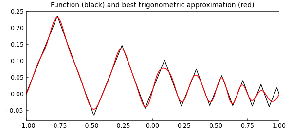
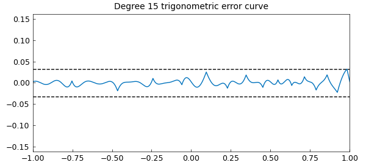
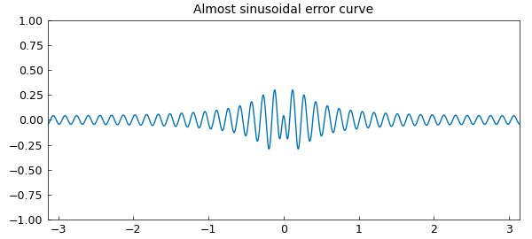

# Best trigonometric approximation with trigremez

*Mohsin Javed and Nick Trefethen, February 2015*

[Original MATLAB Chebfun example](https://www.chebfun.org/examples/fourier/BestTrigApprox.html)

Python translation: [`examples/fourier/best_trig_approx.py`](https://github.com/ma-gilles/chebfunjax/blob/main/examples/fourier/best_trig_approx.py)

Chebfun's $\verb|trigremez|$ command can be used to find best (i.e. infinity-norm or minimax) trigonometric polynomial approximations of a real-valued continuous function on a periodic interval. For example, here is a periodic function on $[-\pi, \pi]$ and its best approximation by a trigonometric polynomial of degree $5$:

```matlab
f = chebfun(@(x) exp(sin(2*x)+cos(3*x)), [-pi, pi], 'trig');
[p,err] = trigremez(f,5);
plot(f,'k',p,'r')
title('Function (black) and best trigonometric approximation (red)')
```



The error equioscillates, and the number of equioscillating extreme points is at least one more than the dimension of the approximation space. In the present case of a degree $5$ trigonometric approximation, the dimension of the approximation space is $11$, and hence the error curve must have at least 12 points of equioscillation:

```matlab
plot(f-p), hold on
plot([-pi pi], err*[1 1],'--k')
plot([-pi pi],-err*[1 1],'--k')
ylim(5*err*[-1, 1]), hold off
title('Degree 5 trigonometric error curve')
```



The $\verb|trigremez|$ command works for any chebfun, even a chebfun that is constructed without the `trig` flag, as long as it is continuous in the interior of the domain and takes the same value at both endpoints. Here is an example:

```matlab
fh = @(x) 10*abs(x) + sin(20*pi*x) + 10*exp(-50*(x-.1)^2);
f = chebfun(fh, 'splitting', 'on' );
```

```matlab
[p, err] = trigremez(f, 8);
plot(f,'k',p,'r')
title('Function (black) and best trigonometric approximation (red)')
```



And here is a plot of the error curve:

```matlab
plot(f-p), hold on
plot([-pi pi], err*[1 1],'--k')
plot([-pi pi],-err*[1 1],'--k')
ylim(5*err*[-1 1]), hold off
title('Degree 8 trigonometric error curve')
```



Here is another example where we first define a zig-zag function, which is aperiodic, but then make it periodic by subtracting off an appropriate linear term:

```matlab
x = chebfun('x');
g = cumsum(sign(sin(20*exp(x))));
m = (g(1) - g(-1))/2;
y = m*(x - 1) + g(1);
f = g - y;
[p, err] = trigremez(f, 15);
plot(f,'k',p,'r')
title('Function (black) and best trigonometric approximation (red)')
```



Again, the error plot equioscillates beautifully:

```matlab
plot(f-p), hold on
plot([-1 1], err*[1 1],'--k')
plot([-1 1],-err*[1 1],'--k')
ylim(5*err*[-1 1]), hold off
title('Degree 15 trigonometric error curve')
```



Experienced best approximators are used to seeing error curves that look approximately like Chebyshev polynomials, and indeed, there are theorems to the effect that for functions satisfying appropriate smoothness conditions, the best polynomial approximation error curves approach Chebyshev polynomials as the degree approaches infinity. In trigonometric rather than algebraic best approximation, however, the error curves tend to look like sine waves, not Chebyshev polynomials. To the experienced eye, this can be quite a surprise. The following example illustrates this:

```matlab
f = chebfun('1/(1.01-cos(x))',[-pi,pi],'trig');
plot(f-trigremez(f,40)), ylim([-1 1])
title('Almost sinusoidal error curve')
```



The flavor of $\verb|trigremez|$ and the periodic Remez algorithm that it utilizes could not be more classical. Nevertheless, we are unaware of any previous computations of general periodic best approximations. Electrical engineers compute approximations all the time that appear to be periodic---the Parks-McClellan algorithm---but because of a symmetry, these computations are carried out using the ordinary polynomial Remez algorithm.

## References

1. M. Javed, *Algorithms for Trigonometric Polynomial and Rational Approximation*, DPhil dissertation, University of Oxford, 2016.

---

*Translated with [chebfunjax](https://github.com/ma-gilles/chebfunjax); prose and MATLAB code from the original example, copyright The University of Oxford and The Chebfun Developers.  Printed outputs and figures are chebfunjax's.*
