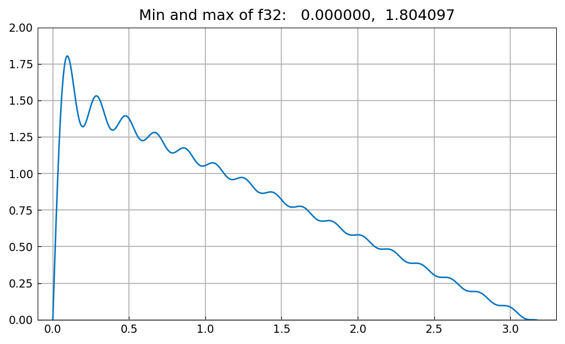
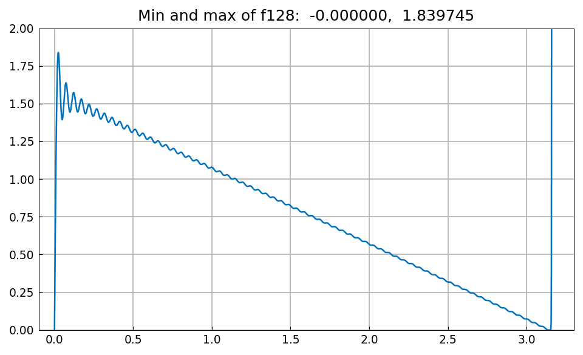
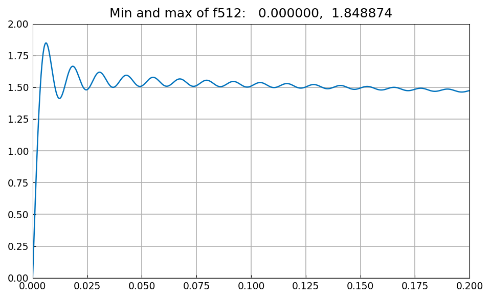
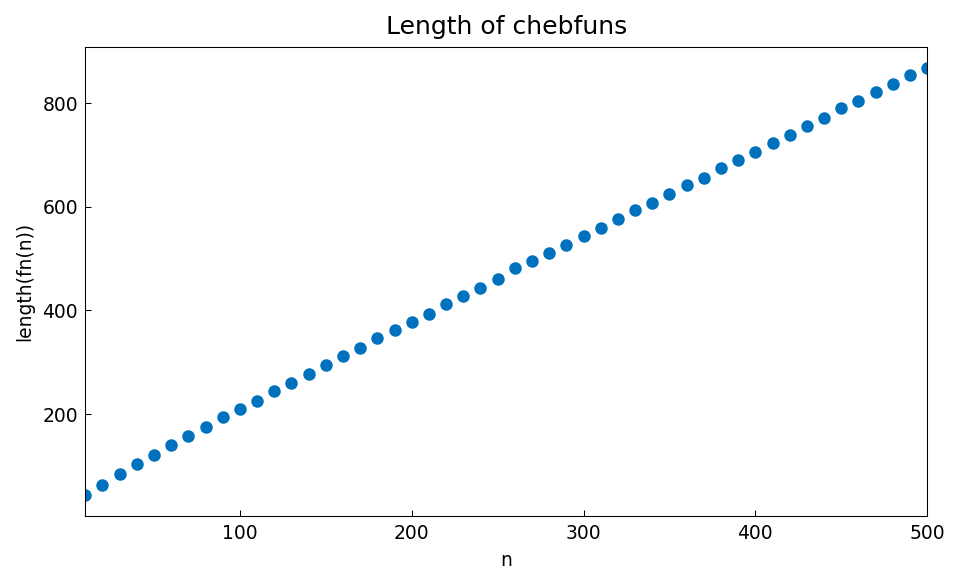
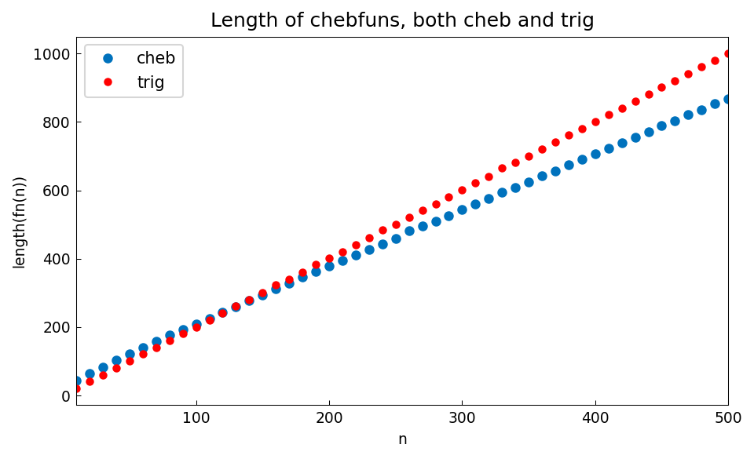

# Fejer-Jackson inequality

*Nick Trefethen, July 2015*

[Original MATLAB Chebfun example](https://www.chebfun.org/examples/fourier/FejerJackson.html)

(Chebfun example fourier/FejerJackson.m)

The Fejer-Jackson inequality asserts that the partial sums of the
Fourier series of the sawtooth function,

$$ f_n(x) = \sum_{k=1}^{n} \frac{\sin(kx)}{k}, $$

are positive for $x \in (0, \pi)$.  We can verify this in chebfunjax by
constructing the partial sums and computing their minima.  Here is
$f_{32}$, whose minimum on $[0,\pi]$ is zero (attained at the
endpoints) and whose maximum overshoots $\pi/2$ — the Gibbs phenomenon:

```python
import jax.numpy as jnp
import numpy as np
import chebfunjax as cj

def fnx(n):
    ks = jnp.arange(n, 0, -1, dtype=jnp.float64)
    def op(x):
        xx = jnp.atleast_1d(jnp.asarray(x, dtype=jnp.float64))
        return jnp.sum(jnp.sin(xx[..., None] * ks) / ks, axis=-1)
    return op

fn = lambda n: cj.chebfun(fnx(n), domain=[0.0, np.pi])
f32 = fn(32)
```



With larger $n$ the overshoot approaches the Gibbs-Wilbraham constant
$\int_0^\pi \frac{\sin t}{t}\, dt = 1.8519\ldots$:



For $n = 512$, zooming in near $x = 0$:



The lengths of the chebfun representations grow linearly with $n$:



A trig representation on $[0, 2\pi]$ captures $f_n$ with exactly
$2n+1$ Fourier modes, while the Chebyshev representation needs about
$\pi/2$ points per wavelength:


