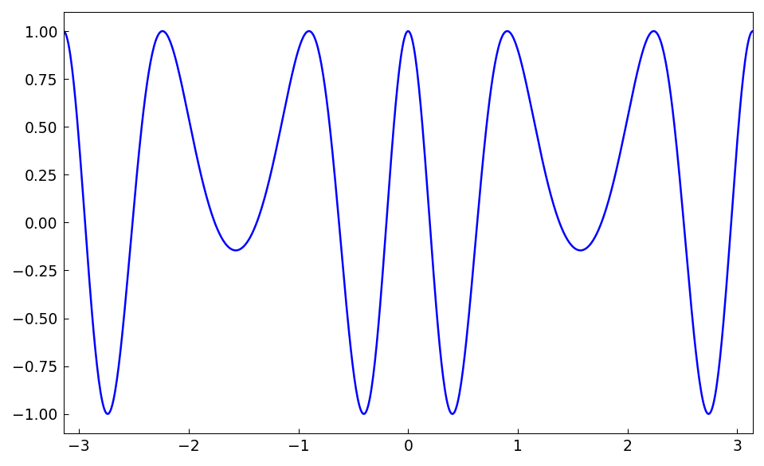
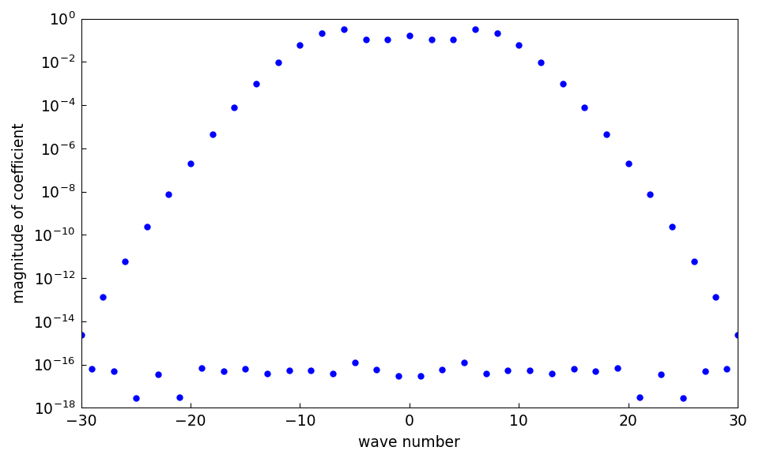
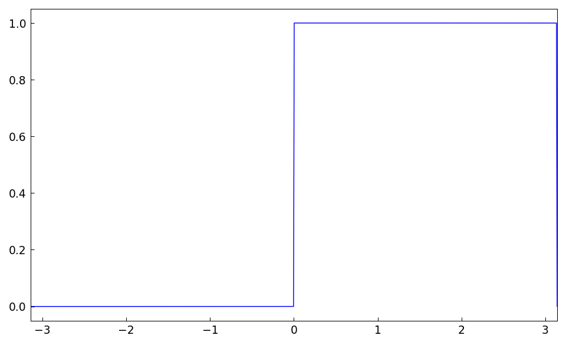
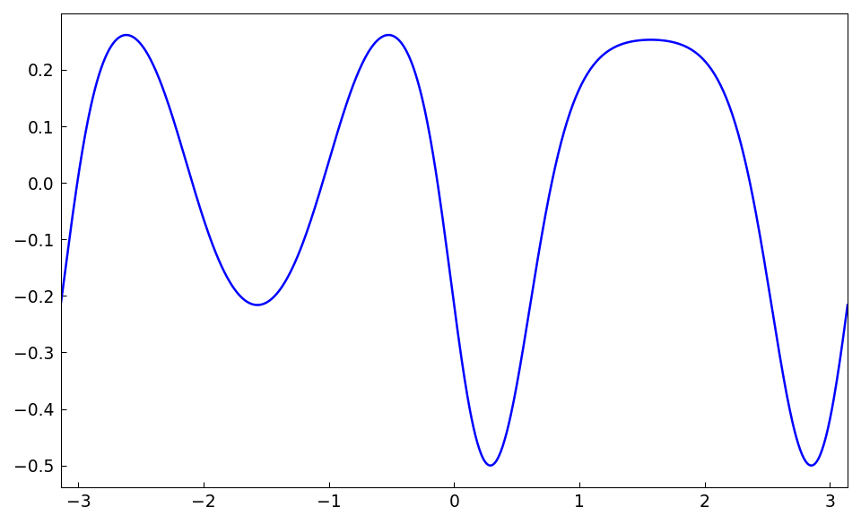
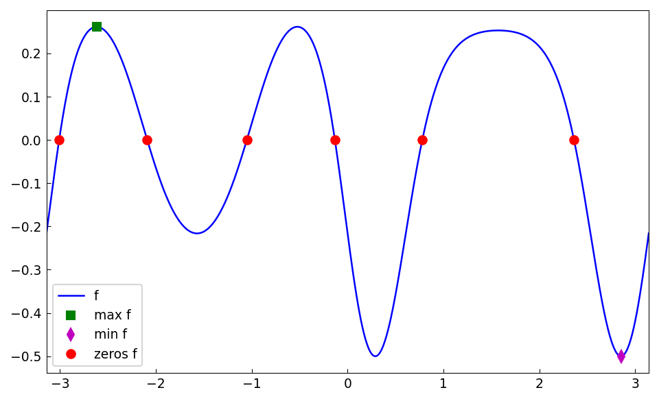
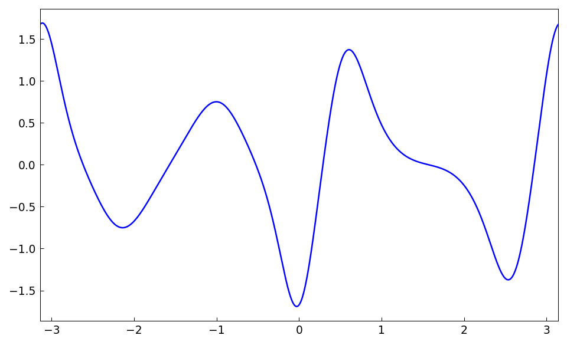
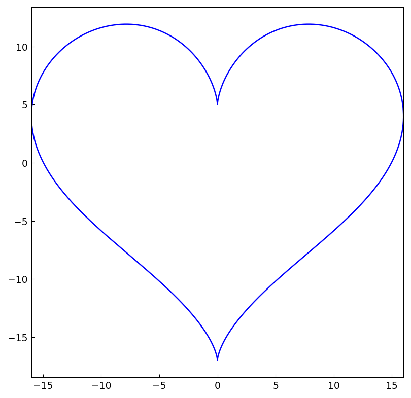
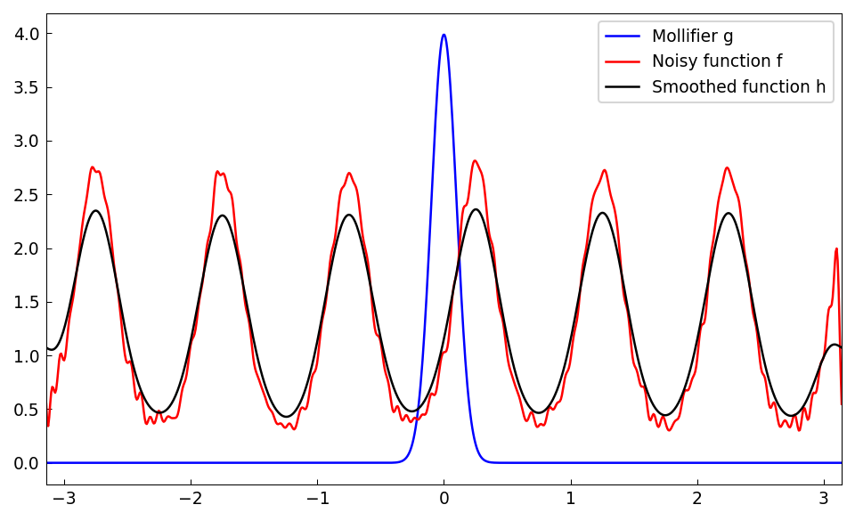

# Fourier-based chebfuns

*Grady Wright, June 2014*

[Original MATLAB Chebfun example](https://www.chebfun.org/examples/fourier/FourierBasedChebfuns.html)

(Chebfun example fourier/FourierBasedChebfuns.m)

One of the new features of Chebfun version 5 is the ability to create
chebfuns of smooth periodic functions using Fourier series. This example
introduces and demonstrates some of the functionality of this new tool.

## Construction and comparison

Fourier-based chebfuns, or "trigfuns" as we like to refer to them, can be
created with the use of the `trig=True` flag in the chebfun constructor.
For example, the function $f(x) = \cos(8\sin(x))$ for $-\pi \leq x \leq
\pi$ can be constructed as follows:

```python
import jax.numpy as jnp
import numpy as np
import chebfunjax as cj

dom = [-np.pi, np.pi]
f = cj.chebfun(lambda x: jnp.cos(8 * jnp.sin(x)), domain=dom, trig=True)
print("f ="); print(repr(f))
```
```
f =
   chebfun column (1 smooth piece)
       interval       length     endpoint values  
[    -3.1,     3.1]       61         1        1 
vertical scale =   1 
```



Here $f$ is represented to machine precision using a Fourier interpolant
rather than a Chebyshev interpolant. The displayed information for $f$ above
shows that it is of length 61, meaning that $f$ is resolved to machine
precision using 61 samples, or $(61-1)/2=30$ (complex) Fourier modes. These
coefficients can be displayed graphically:



Since $f$ is smooth and periodic, a Fourier representation requires fewer
terms than a Chebyshev representation of $f$ to reach machine precision.
We can check this by constructing $f$ without the `trig` flag:

```python
f_cheby = cj.chebfun(lambda x: jnp.cos(8 * jnp.sin(x)), domain=dom)
```
```
f_cheby =
   chebfun column (1 smooth piece)
       interval       length     endpoint values  
[    -3.1,     3.1]      103         1        1 
vertical scale =   1 
```

The ratio of length of the Chebyshev series to the Fourier series should
be approximately $\pi/2$ since the former has a resolution power of
$\pi$ points per wavelength and the latter of 2 points per wavelength.
We can check this numerically as

```python
ratio = len(f_cheby) / len(f)
theoretical = np.pi / 2
```
```
ratio =
   1.688525
theoretical =
   1.570796
```

Trying to construct a trigfun from a non-periodic or non-smooth function
will typically result in a warning being issued and an "unhappy" trigfun,
as illustrated for the unit step function below:

```python
f = cj.chebfun(lambda x: 0.5 * (1.0 + jnp.sign(x)), domain=dom, trig=True)
```
```
f =
   chebfun column (1 smooth piece)
       interval       length     endpoint values  
[    -3.1,     3.1]    65536         0        0 
vertical scale =   1 
```



The length of $f$ is 65536, which is the maximum number of samples used
in the construction process to try to resolve $f$. The famous Gibbs
phenomenon can be seen near the discontinuity in the plot of $f$. Chebfun
can be used to represent this function in non-periodic mode (i.e. using
Chebyshev series) with the option of `splitting=True`:

```python
f = cj.chebfun(lambda x: 0.5 * (1.0 + jnp.sign(x)), domain=dom,
               splitting=True)
```
```
f =
   chebfun column (2 smooth pieces)
       interval       length     endpoint values  
[    -3.1, 6.7e-16]        1         0        0 
[ 6.7e-16,     3.1]        1         1        1 
vertical scale =   1    Total length = 2
```

Splitting is not an option for trigfuns.

## Basic operations

Many Chebfun operations can also be applied directly to a trigfun.
Some of these basic operations are illustrated in the examples below.

Addition, subtraction, multiplication, division, and function composition
can all be directly applied to a trigfun.  However one should be aware that
the operation should result in a smooth and periodic function. (If not, it
will be converted to a nonperiodic chebfun.)
The following example illustrates some of these operations:

```python
f = cj.chebfun(
    lambda x: jnp.tanh(jnp.cos(1 + 2 * jnp.sin(x)) ** 2) - 0.5,
    domain=dom, trig=True)
```
```
f =
   chebfun column (1 smooth piece)
       interval       length     endpoint values  
[    -3.1,     3.1]      161     -0.22    -0.22 
vertical scale = 0.5 
```



The max, min, and roots of $f$ can be computed by

```python
(xminf, minf), (xmaxf, maxf) = f.minandmax()
rootsf = f.roots()
```
```
maxf =
   0.261594
minf =
  -0.500000
rootsf =
  -3.009212
  -2.090420
  -1.051172
  -0.132380
   0.779312
   2.362280
```

These can be visualized as



The derivative of $f$ is computed using `diff`:

```python
df = f.diff()
```



and the definite integral is computed using `sum`:

```python
intf = f.sum()
```
```
intf =
  -0.074011
```

Complex-valued trigfuns are also possible. For example:

```python
f = cj.chebfun(
    lambda x: 1j * (13 * jnp.cos(x) - 5 * jnp.cos(2 * x)
                    - 2 * jnp.cos(3 * x) - jnp.cos(4 * x))
    + 16 * jnp.sin(x) ** 3, domain=dom, trig=True)
```
```
f =
   chebfun column (1 smooth piece)
       interval       length     endpoint values  
[    -3.1,     3.1]        9     complex values 
vertical scale =  17 
```



The area enclosed by this curve can be computed as

```python
area_heart = abs(float((f.real() * f.imag().diff()).sum()))
```
```
area_heart =
  565.486678
```

According to [1], the true area enclosed is $180\pi$. The relative error
in the computation above is then

```python
err = (area_heart - 180 * np.pi) / (180 * np.pi)
```
```
err =
    -6.031274062627113e-16
```

The convolution of two smooth periodic functions can be computed using
the `circconv` (circular convolution) function. The example below
demonstrates this function in combination with the additional feature
that allows trigfuns to be constructed from function values. The latter
is demonstrated first:

```python
rng = np.random.RandomState(0)
n = 201
x, _ = cj.trigpts(n, tuple(dom))
func_vals = np.exp(np.sin(2 * np.pi * np.asarray(x))) + 0.05 * rng.randn(n)
f = trig_chebfun_from_values(func_vals, dom)
```
```
f =
   chebfun column (1 smooth piece)
       interval       length     endpoint values  
[    -3.1,     3.1]      201      0.55     0.55 
vertical scale = 2.8 
```

(The noise realisation differs from the published page: MATLAB's
`rng(0)` ziggurat `randn` stream is not reproducible in NumPy.)

Here $f$ interpolates the noisy `func_vals` at 201 equally spaced points
from $[-\pi,\pi)$ using the Fourier basis. The high frequencies in this
function can be smoothed by convolving it with a mollifier, in this case
a (normalized) Gaussian with variance 0.1.

```python
sigma = 0.1
g = cj.chebfun(
    lambda t: 1 / (sigma * np.sqrt(2 * np.pi))
    * jnp.exp(-0.5 * (t / sigma) ** 2), domain=dom, trig=True)
```

Note that the resulting representation of $g$ is actually the periodic
extension of the Gaussian over $[-\pi,\pi]$.  The convolution of $f$ and
$g$ is computed and visualized using

```python
h = f.circconv(g)
```



## References

1. Mathworld Heart Curve: http://mathworld.wolfram.com/HeartCurve.html
