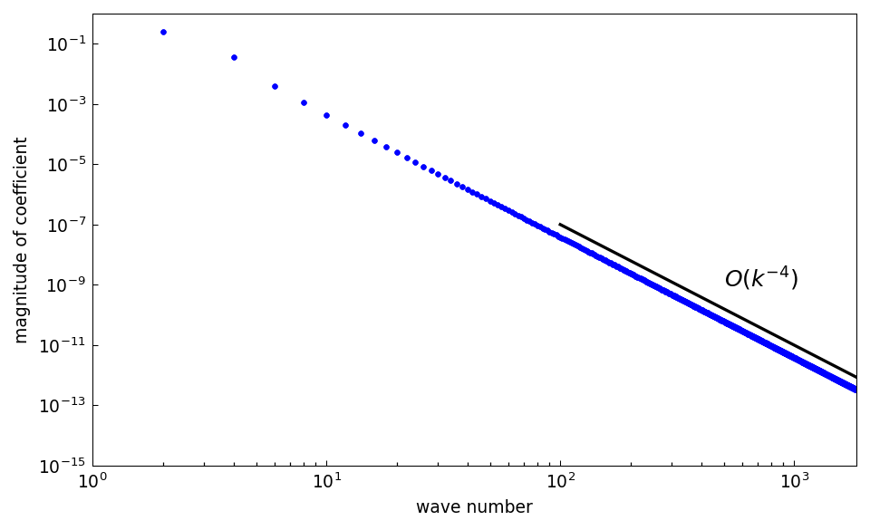
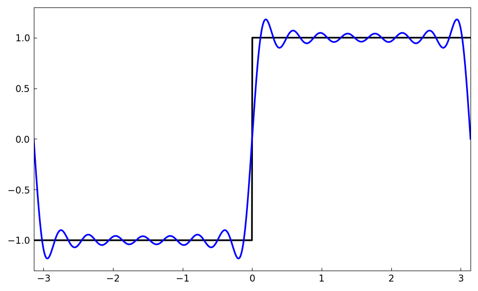
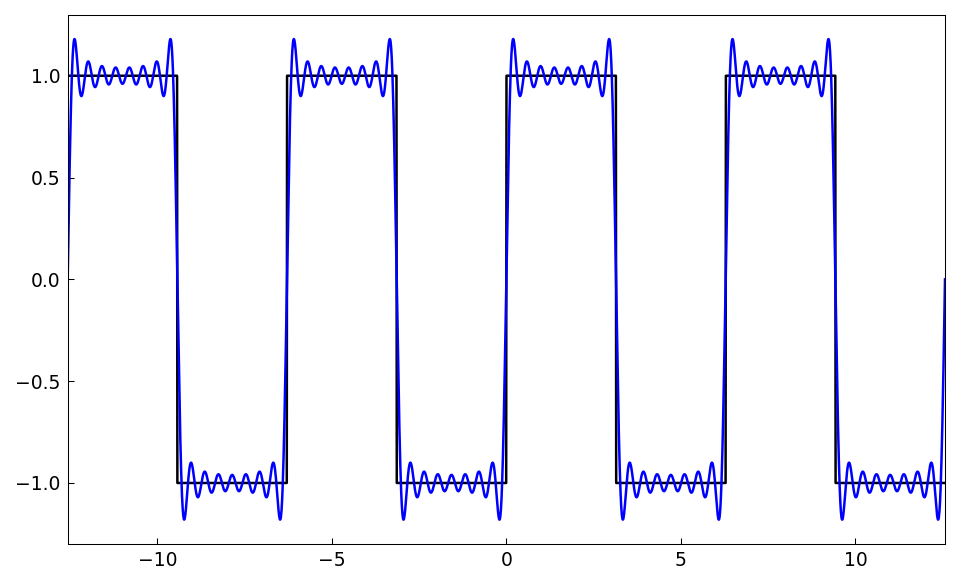
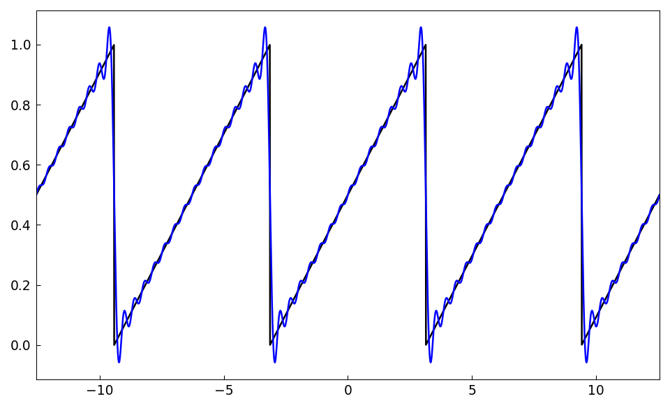

# Fourier coefficients

*Grady Wright, June 2014*

[Original MATLAB Chebfun example](https://www.chebfun.org/examples/fourier/FourierCoefficients.html)

(Chebfun example fourier/FourierCoefficients.m)

The Fourier series of a function $u \in L^{2}[-\pi,\pi]$ is given as

$$ \mathcal{F}[u] = \sum_{k=-\infty}^{\infty} c_k e^{ikx} $$

where $c_k = \frac{1}{2\pi} \int_{-\pi}^{\pi} f(x)e^{-ikx} dx.$
Alternatively, we can express the series in terms of sines and cosines:

$$ \mathcal{F}[u] = \sum_{k=0}^{\infty} a_k \cos(k x) + \sum_{k=1}^{\infty} b_k \sin(k x) $$

with the standard integral formulas for $a_k$ and $b_k$.  Similar
expressions hold for more general intervals $[a,b]$ by shifting and
scaling appropriately.  The Fourier coefficients for many functions $u$
can be computed in chebfunjax using the `trigcoeffs` method.

## Smooth periodic functions

Typically, if $u$ and its periodic extension are twice continuously
differentiable, the Fourier coefficients can be computed by constructing
$u$ with the `trig` flag, then calling `trigcoeffs`.  Here is an example
for a simple Fourier polynomial:

```python
import jax.numpy as jnp
import numpy as np
import chebfunjax as cj

dom = [-np.pi, np.pi]
u = cj.chebfun(lambda x: 1 - 4 * jnp.cos(x) + 6 * jnp.sin(2 * x),
               domain=dom, trig=True)
c = u.trigcoeffs()
```
```
Fourier coeffs of 1 - 4*cos(x) + 6*sin(2*x):
c =
  -0.000000000000000 + 3.000000000000000i
  -2.000000000000000 + 0.000000000000000i
   1.000000000000000 + 0.000000000000000i
  -2.000000000000000 + 0.000000000000000i
  -0.000000000000000 - 3.000000000000000i
Fourier cosine coeffs of 1 - 4*cos(x) + 6*sin(2*x)
```

`trigcoeffs` returns the coefficients in complex exponential form on
ascending modes.  The equivalent coefficients in terms of cosines and
sines can be obtained as:

```python
a, b = u.trigcoeffs(form="cos_sin")
```
```
a =
    1.000000000000000
   -3.999999999999999
   -0.000000000000000
Fourier sine coeffs of 1 - 4*cos(x) + 6*sin(2*x)
b =
    0.000000000000000
    6.000000000000000
Fourier coeffs of 3/(5-4cos(x)):
```

Note that `a` contains the constant term in the series as its first
coefficient followed by the coefficients for $\cos(x)$ and $\cos(2x)$,
while `b` starts with the coefficient for $\sin(x)$ followed by the
coefficient for $\sin(2x)$.

The default behavior of `trigcoeffs` is to return all the Fourier
coefficients necessary to resolve the function to machine precision.
However, a specific number can be obtained with an additional input
argument.  We illustrate this feature on the function
$f(x) = 3/(5 - 4\cos(x))$, which is analytic in a strip in the complex
plane and has exact Fourier coefficients given by $c_k = 2^{-|k|}$:

```python
numCoeffs = 11
u = cj.chebfun(lambda x: 3.0 / (5 - 4 * jnp.cos(x)), domain=dom,
               trig=True)
c = u.trigcoeffs(numCoeffs)
```
```
c =
   0.031250000000000 - 0.000000000000000i
   0.062500000000000 - 0.000000000000000i
   0.125000000000000 - 0.000000000000000i
   0.250000000000000 - 0.000000000000000i
   0.500000000000000 - 0.000000000000000i
   1.000000000000000 + 0.000000000000000i
   0.500000000000000 - 0.000000000000000i
   0.250000000000000 - 0.000000000000000i
   0.125000000000000 + 0.000000000000000i
   0.062500000000000 + 0.000000000000000i
   0.031250000000000 + 0.000000000000000i
Fourier coeffs of |sin(x)|^3
c =
```

We see that the computed results match the exact results to machine
precision.

## Finitely smooth functions

For functions with only finitely many continuous derivatives, such as
$|\sin(x)|^3$, the Fourier coefficients decay only algebraically:

```python
numCoeffs = 17
u = cj.chebfun(lambda x: jnp.abs(jnp.sin(x)) ** 3, domain=dom,
               trig=True)
c = u.trigcoeffs(numCoeffs)[::-1]
```
```
   0.001102371900204 - 0.000000000000000i
  -0.000000000000000 - 0.000000000000000i
   0.004042030300747 - 0.000000000000000i
  -0.000000000000000 + 0.000000000000000i
   0.036378272706719 + 0.000000000000000i
   0.000000000000000 - 0.000000000000000i
  -0.254647908947032 + 0.000000000000000i
  -0.000000000000000 - 0.000000000000000i
   0.424413181578388 + 0.000000000000000i
  -0.000000000000000 + 0.000000000000000i
  -0.254647908947032 + 0.000000000000000i
   0.000000000000000 + 0.000000000000000i
   0.036378272706719 + 0.000000000000000i
  -0.000000000000000 - 0.000000000000000i
   0.004042030300747 - 0.000000000000000i
  -0.000000000000000 + 0.000000000000000i
   0.001102371900204 - 0.000000000000000i
ans =
   3697
Fourier sine coeffs of unit step function:
b =
```

The coefficients decay like $O(k^{-4})$:



## Non-smooth functions

For a function with a jump, such as the square wave, `trigcoeffs` with
an explicit $N$ computes the coefficients by integration (the function
is built in non-periodic splitting mode).  The sine coefficients follow
the classical $4/(\pi k)$ law for odd $k$:

```python
sq_wave = lambda x: jnp.sign(jnp.sin(x))
u = cj.chebfun(sq_wave, domain=dom, splitting=True)
a, b = u.trigcoeffs(15, form="cos_sin")
```
```
    1.273239544735163
   -0.000000000000000
    0.424413181578388
   -0.000000000000000
    0.254647908947033
    0.000000000000000
    0.181891363533594
            k               pi/4*b_k
   1.0000    1.000000000000000
   2.0000    -0.000000000000000
   3.0000    0.333333333333333
   4.0000    -0.000000000000000
   5.0000    0.200000000000000
   6.0000    0.000000000000000
   7.0000    0.142857142857143
ans =
   6.743397905587548e-16
```

The truncated Fourier series reconstruction exhibits the Gibbs
phenomenon at the jumps:

```python
numModes = 15
c = u.trigcoeffs(2 * numModes + 1)
u_trunc = cj.chebfun(c, domain=dom, trig=True, coeffs=True)
```



The trigfun `u_trunc` is the periodic extension of the truncated
series, visualized here over $[-4\pi, 4\pi]$:



The same construction for the sawtooth wave:


