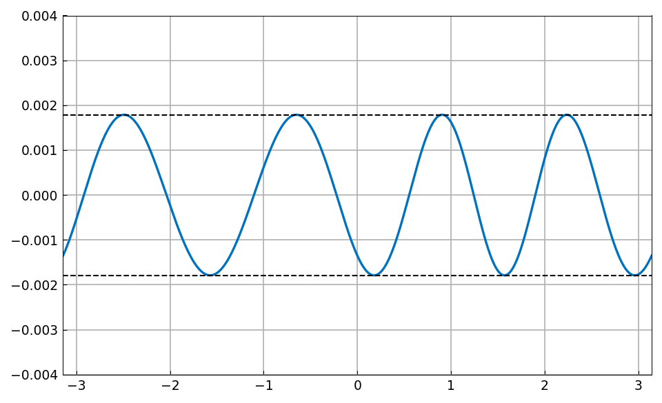

# Periodic CF approximation: Eureka!

*Nick Trefethen, February 2017*

[Original MATLAB Chebfun example](https://www.chebfun.org/examples/fourier/TrigCFExample.html)

(Chebfun example fourier/TrigCFExample.m)

Carathéodory-Fejér approximation constructs near-best rational
approximations from the singular values and vectors of a Hankel matrix
of Taylor or Fourier coefficients.  For periodic functions the theory
is particularly clean.  Here is a Hankel matrix norm as a warm-up:

```python
import numpy as np
import scipy.linalg as sla
from scipy.special import factorial

np.linalg.norm(sla.hankel(1.0 / factorial(np.arange(3, 10))), 2)
```
```
ans =
   0.177373815210096
```

Now take the periodic function $f(t) = e^{\sin t}$ and extract its
Fourier coefficients:

```python
import jax.numpy as jnp
import chebfunjax as cj

f = cj.chebfun(lambda t: jnp.exp(jnp.sin(t)),
               domain=[-np.pi, np.pi], trig=True)
c = f.trigcoeffs()
c = c[(len(c) + 1) // 2 - 1:]   # nonnegative modes
```

For a type $(m, n)$ periodic rational approximation, form the Hankel
matrix of the coefficients starting at index $1 + m - n$; twice the
$(n+1)$st singular value is the CF prediction of the minimax error:

```python
m, n = 2, 1
H = sla.hankel(c[1 + m - n:])
s = np.linalg.svd(H, compute_uv=False)
2 * s[n]
```
```
ans =
  -0.1357 + 0.0000i    0.0000 + 0.0222i    0.0027 + 0.0000i
   0.0000 + 0.0222i    0.0027 + 0.0000i   -0.0000 - 0.0003i
   0.0027 + 0.0000i   -0.0000 - 0.0003i   -0.0001 + 0.0000i
ans =
   0.001789066755256
```

Eureka: the true minimax error from the rational trigonometric Remez
algorithm agrees to about ten digits:

```python
p, q, r, err, status = cj.trigremez(f, m, n)
```
```
err =
   0.001789066754501
```

The equioscillating error curve of the type $(2,1)$ best approximation:


