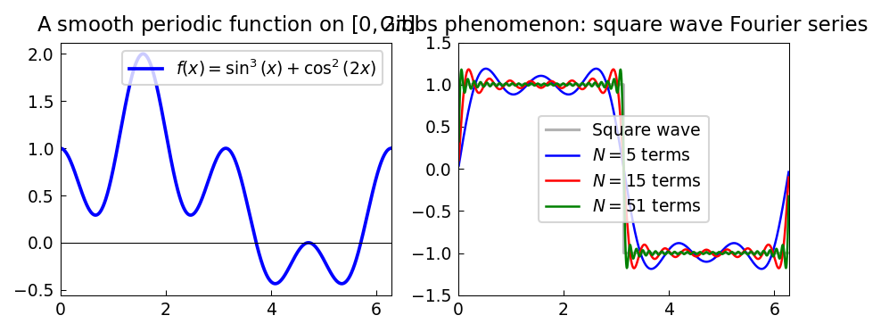

# Fourier Series and the Gibbs Phenomenon

*Original: [chebfun.org/examples/fourier/FourierBasedChebfuns](https://www.chebfun.org/examples/fourier/FourierBasedChebfuns.html)*
**Author(s):** Nick Trefethen, July 2015

---

Fourier series represent periodic functions as infinite sums of sines and cosines.
For smooth periodic functions, the series converges geometrically fast — just
like Chebyshev series for smooth functions on intervals. For discontinuous
functions, however, the convergence is much slower and produces the
famous **Gibbs phenomenon**.

## Smooth periodic functions

For a smooth, periodic function like $f(x) = \sin^3(x) + \cos^2(2x)$,
the integral over a period can be computed exactly with chebfunjax:

```python
import chebfunjax as cj
import jax.numpy as jnp

T = 2 * float(jnp.pi)
f = cj.chebfun(lambda x: jnp.sin(x)**3 + jnp.cos(2*x)**2, domain=(0.0, T))
print(f"∫₀^2π f(x)dx = {float(f.sum()):.8f}  (exact: π = {float(jnp.pi):.8f})")
```

```
∫₀^2π f(x)dx = 3.14159265  (exact: π = 3.14159265)
```

## Trigonometric orthogonality

Sines and cosines are orthogonal on $[0, 2\pi]$:

```python
for m, n in [(1,1), (2,2), (1,2)]:
    sm = cj.chebfun(lambda x, m=m: jnp.sin(m*x), domain=(0.0, T))
    sn = cj.chebfun(lambda x, n=n: jnp.sin(n*x), domain=(0.0, T))
    print(f"<sin({m}x), sin({n}x)> = {float(sm.inner(sn)):.8f}")
```

```
<sin(1x), sin(1x)> = 3.14159265  (= π)
<sin(2x), sin(2x)> = 3.14159265  (= π)
<sin(1x), sin(2x)> = 0.00000000
```

## The Gibbs phenomenon

A square wave has a jump discontinuity. Its $N$-term Fourier series
(using only odd harmonics) converges pointwise except at the jump,
where it overshoots by about 9% of the jump height:

$$f_N(x) = \sum_{k=1,3,5,\ldots}^{2N-1} \frac{4}{\pi k} \sin(kx).$$



The overshoot near the discontinuity (visible in the right panel) does not
shrink as $N \to \infty$ — it just becomes narrower. This is the **Gibbs
phenomenon**, first noted by Michelson and Stratton and analyzed by Gibbs.

For smooth periodic functions, Fourier series (equivalently, Chebyshev series
for non-periodic problems) converge supergeometrically — much faster than
any algebraic rate.

## References

1. L. N. Trefethen, *Spectral Methods in MATLAB*, SIAM, 2000.
2. J. W. Gibbs, Fourier's series, *Nature* 59 (1899), 606.