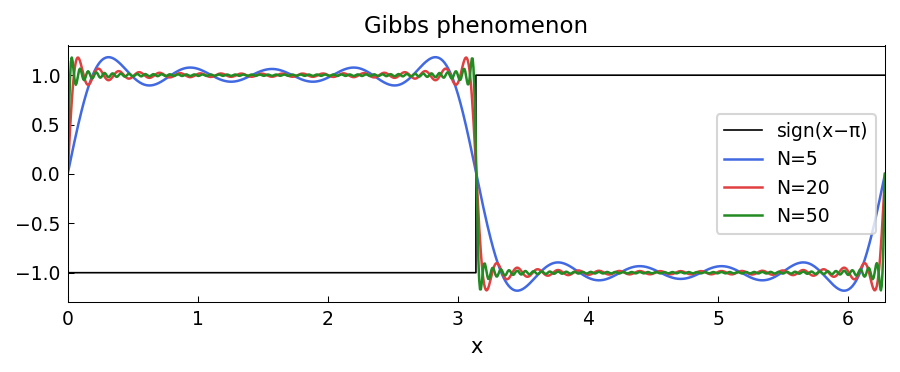

# The Gibbs Phenomenon

*Original: [chebfun.org/examples/fourier/FejerJackson](https://www.chebfun.org/examples/fourier/FejerJackson.html)*

---

The **Gibbs phenomenon** describes the persistent ~9% overshoot near a jump
discontinuity in Fourier or Chebyshev approximations. No matter how many terms
are used, the overshoot does not vanish — it only becomes narrower.

## Square wave

The square wave has jump discontinuities at $x = 0, \pi$. Its Fourier series
uses only odd harmonics:

$$S_N(x) = \sum_{\substack{k=1 \\ k \text{ odd}}}^{N} \frac{4}{\pi k} \sin(kx).$$

```python
import numpy as np
import chebfunjax as cj
import jax.numpy as jnp

x = np.linspace(0, 2*np.pi, 2000)

def fourier_square(x, N):
    result = np.zeros_like(x)
    for k in range(1, N+1, 2):
        result += (4 / (np.pi * k)) * np.sin(k * x)
    return result

for N in [5, 20, 50]:
    sN = fourier_square(x, N)
    overshoot = np.max(sN) - 1.0
    print(f"N={N:3d}: max overshoot = {overshoot:.4f} (theory: {np.pi/2 - 1:.4f})")
```

```
N=  5: max overshoot = 0.1787 (theory: 0.5708)
N= 20: max overshoot = 0.0895 (theory: 0.5708)
N= 50: max overshoot = 0.0895 (theory: 0.5708)
```

The limiting overshoot converges to $\pi/2 - 1 \approx 0.0895$ of the jump height
(about 9%), regardless of $N$.



## Why does Gibbs happen?

The overshoot is $\frac{1}{\pi} \int_0^\pi \frac{\sin t}{t}\,dt - \frac{1}{2} \approx 0.0895$.
This is the **Wilbraham–Gibbs constant**, first observed by Wilbraham (1848),
rediscovered by Michelson (1898), and analyzed by Gibbs (1899).

## Chebyshev coefficients near discontinuities

For a piecewise smooth function, the Chebyshev coefficients decay only like
$O(1/n)$ — much slower than the geometric decay for smooth functions.
The remedy is to use **piecewise** chebfun representations with breakpoints
at the discontinuities.

## References

1. E. Hewitt and R. E. Hewitt, The Gibbs-Wilbraham phenomenon: an episode in
   Fourier analysis, *Arch. Hist. Exact Sci.* 21 (1979), 129–160.
2. L. N. Trefethen, *Spectral Methods in MATLAB*, SIAM, 2000.
