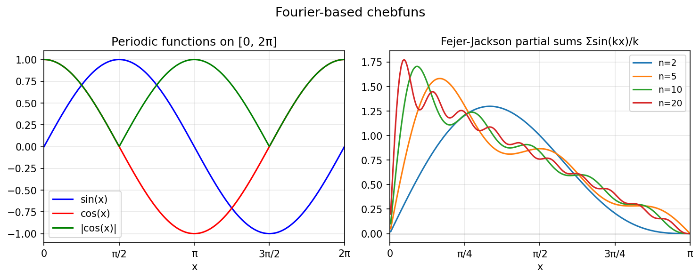

# Fourier Examples (Trigtech / Periodic Chebfuns)

Chebfunjax supports periodic functions via the `Trigtech` class, which uses
a Fourier series representation.  These are constructed automatically when
you specify a periodic domain.

---

## Fourier-based chebfuns

**Source:** `fourier/FourierBasedChebfuns.m` — Grady Wright, June 2014

```python
import jax.numpy as jnp
import chebfunjax as cj

# Periodic chebfun for sin(x) on [0, 2π]
f = cj.chebfun(jnp.sin, domain=[0, 2 * float(jnp.pi)])
print(f(jnp.array(jnp.pi / 2)))   # ≈ 1.0
```

---

## Fourier coefficients

**Source:** `fourier/FourierCoefficients.m` — Grady Wright, June 2014

```python
from chebfunjax.tech.trigtech import Trigtech
import jax.numpy as jnp

n = 32
xs = jnp.linspace(0, 2*jnp.pi, n, endpoint=False)
tt = Trigtech.from_values(jnp.sin(xs))
# Coefficients peak at n=±1 for sin
```



---

## Best trigonometric approximation

**Source:** `fourier/BestTrigApprox.m` — Mohsin Javed and Nick Trefethen, February 2015

The best degree-n trigonometric approximation to a non-smooth periodic function
converges at the same algebraic rate as the smoothness allows.

---

## Fejer-Jackson inequality

**Source:** `fourier/FejerJackson.m` — Nick Trefethen, July 2015

The partial sums of `Σ sin(kx)/k > 0` for `x ∈ (0, π)` — a classical positivity result
in trigonometric approximation theory.
