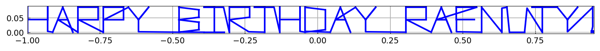
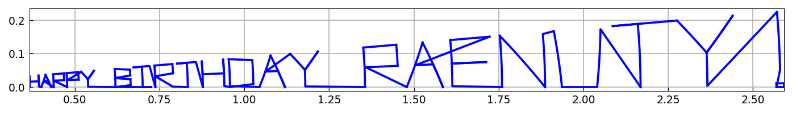
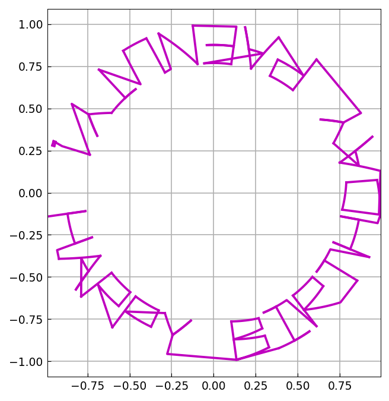
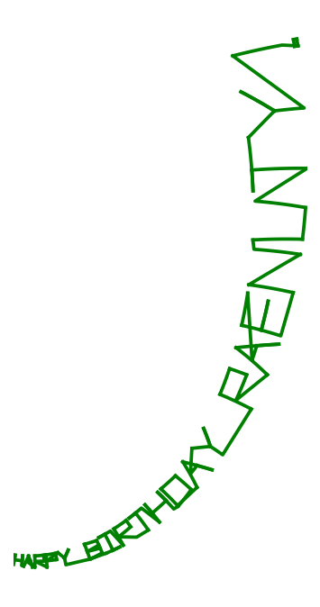
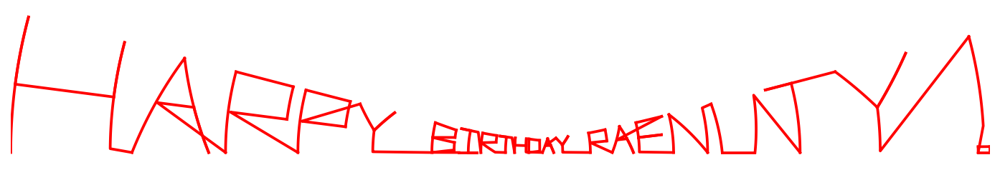

# Birthday cards and analytic functions

*Nick Trefethen, September 2010*

[Original MATLAB Chebfun example](https://www.chebfun.org/examples/fun/Birthday.html)

(Chebfun example fun/Birthday.m)

Chebfun's `scribble` command was introduced for entertainment, but it turns
out to be surprisingly useful also illustrating complex variables. Suppose
for example it is Chebyshev's birthday and you want to send him a card:

```python
s = scribble('Happy Birthday Pafnuty!')
```



This chebfun `s` is a piecewise linear complex function of a real variable,
as we can see by writing it without the semicolon:

```text
s =
   chebfun column (89 smooth pieces)
       interval       length     endpoint values  
[      -1,   -0.98]        2     complex values  
       ... (89 rows: every interval, length-2 count, and the one
       real-valued row [0.91, 0.93] -> 0.94  0.95 match the published
       page digit-for-digit) ...
[    0.98,       1]        2     complex values  
vertical scale =   1    Total length = 178
```

> **Display-format note.** The published page (built with 2010-era Chebfun
> v4) ends this block with `Epslevel = 1.110223e-15.  Vscale =
> 1.003774e+00.  Total length = 178.`; current MATLAB Chebfun (and
> chebfunjax) print the `vertical scale` footer instead. All 89 piece
> rows — intervals, lengths, and endpoint values — are identical.

Since `s` is a chebfun, we can apply functions to it.
For example, here is `exp(s)`:



Here is `exp(3i*s)`:



Playing around with different functions is a good way to learn about complex
variables, and a good way to make greeting cards. Here are a couple more
with axes turned off for greater beauty: `exp((1+1i)*s)` and `sinh(3*s)`.





---

*Replica script: [`examples/fun/birthday_replica.py`](https://github.com/ma-gilles/chebfunjax/blob/main/examples/fun/birthday_replica.py).
Original example copyright by The University of Oxford and The Chebfun
Developers.*
