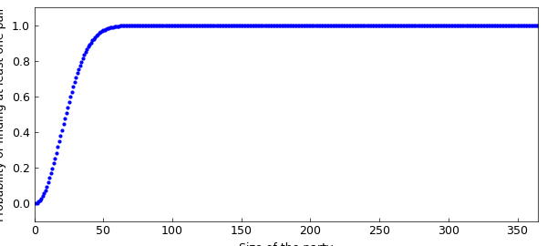
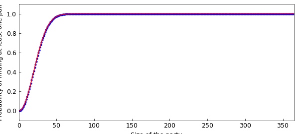

# The birthday paradox

*Mohsin Javed, Alex Townsend, and Nick Hale, LNT's birthday, 2012*

[Original MATLAB Chebfun example](https://www.chebfun.org/examples/fun/BirthdayOdds.html)

Python translation: [`examples/fun/birthday_odds.py`](https://github.com/ma-gilles/chebfunjax/blob/main/examples/fun/birthday_odds.py)

The other day my buddy Pafnuty and I were at our friend Sergei's birthday party, where we were all celebrating and having some fun. Whilst we were standing at the buffet eating some finger food we found out that another friend, Carl Gustav, was having his birthday the same day as well. This seemed odd, and being undergraduate mathematicians we asked ourselves the question: What is the probability that two people in the room share a birthday? (Fortunately Gene hadn't arrived yet, which made things a little simpler). We soon realised that if the number of people was greater than 365, there would surely be at least one pair having the same birthday. First year had taught us that that the pigeonhole principle always holds, even in real life. So we looked around and safely assumed there were fewer than 365 friends in the room; otherwise the probability is immediately one.

```matlab
function birthday
```

```matlab
N = 365;
p = zeros(1,N);
```

(You can make the same assumption on your last birthday, unless you have more than 365 friends.)

We found that it was much easier to think about the case when all the people in the room had distinct birthdays, for then the probabilty $q$ that everyone in the room had distinct birthdays was given by the expression $$ q = 1\left(1-\frac{1}{365}\right) \left(1-\frac{2}{365}\right) \ldots \left(1-\frac{n-1}{365}\right), $$ or we could write $$ q = \prod_{k=0}^{n-1}\left(1-\frac{k}{365}\right). $$ From this the probability of getting at least one "collision" of birthdays was easy. We simply computed $1-q$ and after simplifying the expression for $q$, we were able to write $p$ as $$ p = 1-\frac{365!}{365^n(365-n)!}. $$ However, we quickly realized that the above expression is useless for our calculators, so we applied the standard exp-log trick to the above expression. This gave us a numerically tractable expression for $p$:

```matlab
a = sum(log(1:365));
pk = @(k) 1-exp(a-sum(log(1:(365-k)))-k.*log(365));
```

We then computed the probability of at least one match as a function of the number of people.

```matlab
set(0,'DefaultLineLineWidth',2)
for i = 1:N, p(i) = pk(i); end
plot(1:N,p,'.b'), axis([0 365 -.1 1.1]), hold on
xlabel('Size of the party'), ylabel('Probability of finding at least one pair')
```



The plot looked nice on our graphical calculators and we were intrigued. "Let's make a chebfun out of it!", Pafnuty said. "But for that we will have to evaluate $p$ at non-integer values."

```matlab
function prob = matchProb(n)
    nr = floor(n);
    if nr ==n, prob = pk(n); return, end
    v1 = prod((365:-1:365-nr+1)./(365*ones(1,nr)));
    v2 = prod((365-nr:-1:2)./(365-n:-1:1));
    prob = 1-v1*v2/gamma(2-n+nr)/365^(n-nr);
end
```

We were now ready to make a chebfun.

```matlab
p = chebfun(@(n) matchProb(n), [1 365],'vectorise');
plot(p), hold off
```



We then computed the number of people needed for a 50-50 chance of finding two people with the same birthday. Surprisingly the answer was:

```matlab
ceil(roots(p-.5))
```

```text
ans =
    23
```

Pafnuty was quick to announce: "I will never invite more than 23 people to my birthday!". We then thought about the number of people in the same room for a 99 percent chance of finding at least one pair sharing a birthday. This time we got

```matlab
ceil(roots(p-.99))
```

```text
ans =
    57
```

```matlab
end
```

So here is what we suggest: LNT should throw a party where he invites one friend for each year of his life. If no-one shares a birthday that would make it a very special party indeed!

---

*Translated with [chebfunjax](https://github.com/ma-gilles/chebfunjax); prose and MATLAB code from the original example, copyright The University of Oxford and The Chebfun Developers.  Printed outputs and figures are chebfunjax's.*
