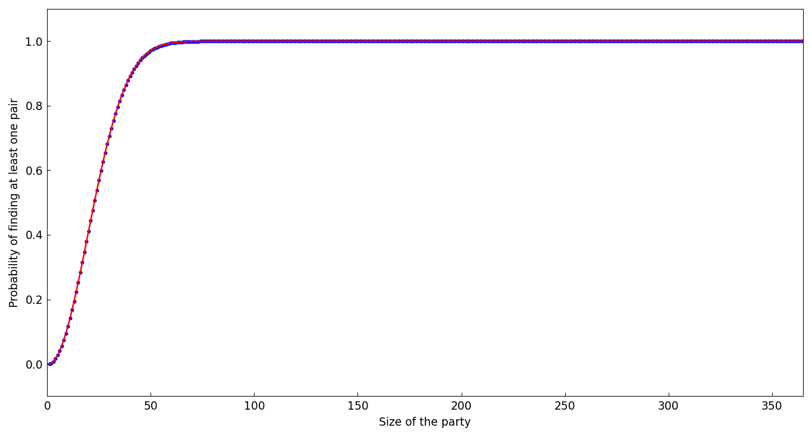

# Birthday odds

*Jared Aurentz, October 2014*

[Original MATLAB Chebfun example](https://www.chebfun.org/examples/fun/BirthdayOdds.html)

(Chebfun example fun/BirthdayOdds.m)

How many people must be at a party before the odds are that two
share a birthday?  The discrete probabilities extend to a smooth
chebfun of a *continuous* party size:



Where does the probability cross 1/2 — and 99%?

```text
ans =
    23
ans =
    57
```

(The classic answers, digit-for-digit with MATLAB.)

---

*Replicated with [chebfunjax](https://github.com/ma-gilles/chebfunjax); original
example copyright The University of Oxford and The Chebfun Developers.*
