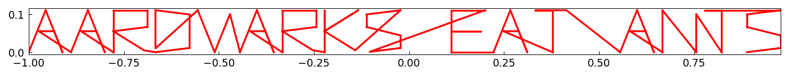
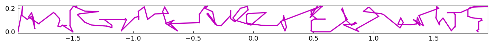
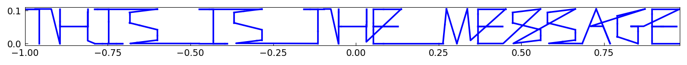
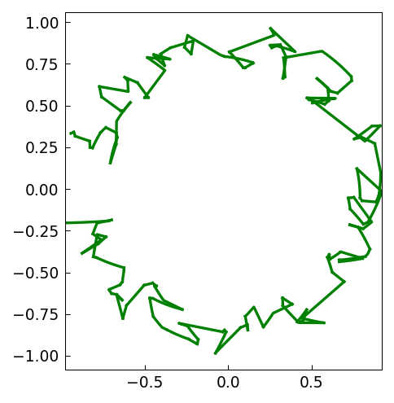
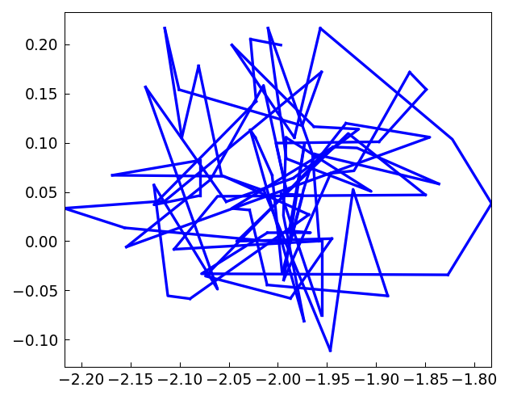

# Encrypting a message with chebfuns

*Nick Trefethen, December 2011*

[Original MATLAB Chebfun example](https://www.chebfun.org/examples/fun/Encryption.html)

(Chebfun example fun/Encryption.m)

A message and a key, both piecewise-linear complex chebfuns from
`scribble`:

Adding the key encrypts; subtracting decrypts:

A nonlinear scrambling $e^{1.5iz}$, undone with `unwrap(log(.))`:

---

*Replicated with [chebfunjax](https://github.com/ma-gilles/chebfunjax); original
example copyright The University of Oxford and The Chebfun Developers.*
