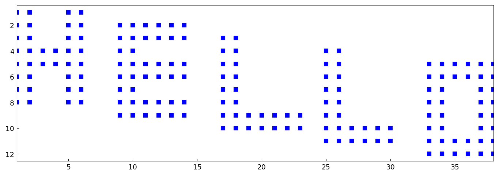
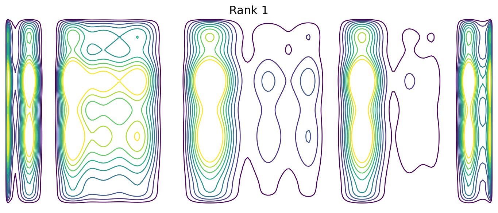

# Hello World, in low rank

*Alex Townsend, March 2013*

[Original MATLAB Chebfun example](https://www.chebfun.org/examples/fun/HelloWorld.html)

(Chebfun example fun/HelloWorld.m)

The words HELLO WORLD as a 15x40 zero-one matrix of exactly rank 10:



```text
ans =
    10
```

A chebfun2 built from the matrix interpolates it to machine
precision:

```text
ans =
     6.506937707541133e-14
```

Truncating the rank shows the words emerging:




---

*Replicated with [chebfunjax](https://github.com/ma-gilles/chebfunjax); original
example copyright The University of Oxford and The Chebfun Developers.*
