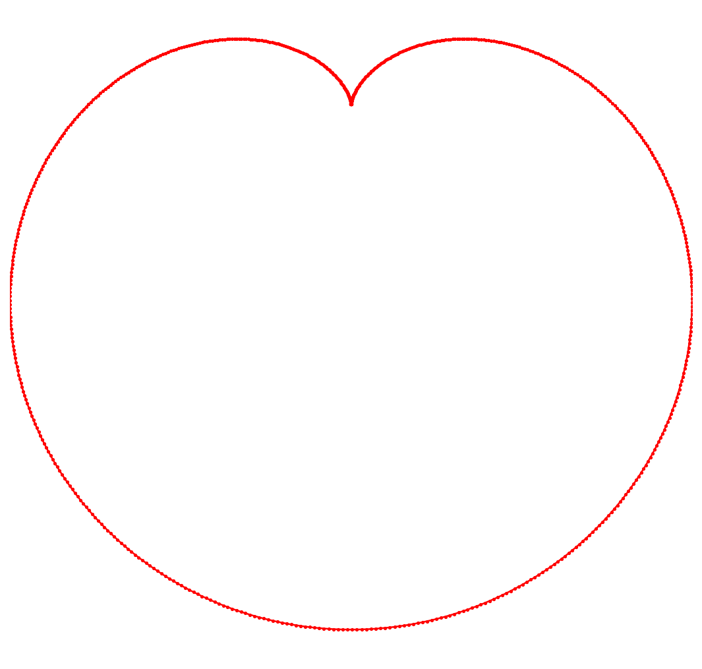

# Happy Valentine's Day

*Nick Hale, February 2012*

[Original MATLAB Chebfun example](https://www.chebfun.org/examples/fun/ValentinesDay.html)

(Chebfun example fun/ValentinesDay.m)

The classic heart curve, with its area by Green's theorem exactly
$180\pi$ — digit-for-digit with MATLAB including the error:


```text
A =
     5.654866776461629e+02
err =
     1.136868377216160e-13
```

The cardioid has area exactly $3\pi/2$:



```text
A1 =
   4.712388980384691
```

And a lumpier heart whose $|\cos t|$ kink needs splitting:


```text
A5 =
  11.645555308722225
```

---

*Replicated with [chebfunjax](https://github.com/ma-gilles/chebfunjax); original
example copyright The University of Oxford and The Chebfun Developers.*
