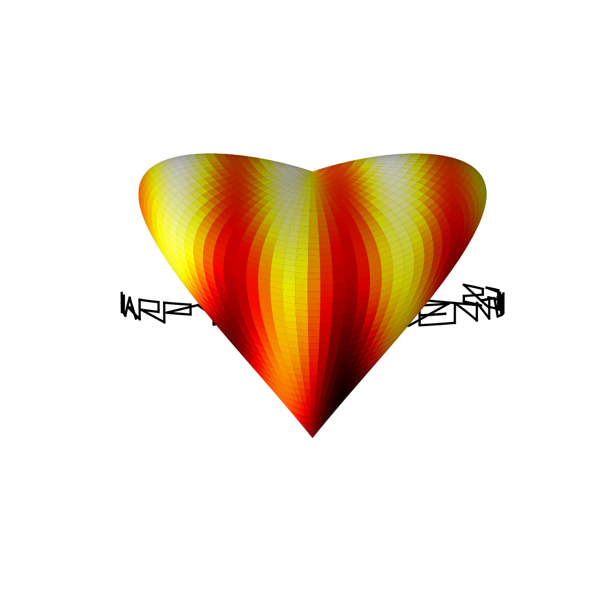

# Happy Valentines Day! (again)

*Anonymous, February 2013*

[Original MATLAB Chebfun example](https://www.chebfun.org/examples/fun/ValentinesDay2.html)

(Chebfun2 example fun/ValentinesDay2.m)

Happy Valentines day to all Chebfun2 users! The original example is a
"love movie": a parametric heart surface

$$X = \sin(\pi t)\cos(\theta/2), \quad Y = 0.7\sin(\pi t)\sin(\theta/2),$$
$$Z = (t-1)\frac{-49+50t+30t\cos\theta+\cos 2\theta}{-25+\cos^2\theta},$$

on $(t,\theta) \in [0,1]\times[0,4\pi]$, colored by
$C = \sin(10X)\cos((Y-0.1)^2)+(Z+1)$ with the `hot` colormap, with the
scribbled greeting `scribble('Happy Valentines Day!')` wrapped around its
waist via

```python
plot3(1.1*cos(2.5*real(S+1)), 0.8*sin(2.5*real(S+1)), 1.5*imag(S)-1.05)
```

The published page has no printed output; its figure is the initial
`view(180, 6)` frame of the rotation loop, replicated here:



(The original then spins the camera through `view(180*ta, 6)` for
`ta = linspace(-1.25, 3, 500)` — a movie, which a static page cannot
show; the published HTML likewise shows only this single frame.)

---

*Replica script: [`examples/fun/valentines_day2_replica.py`](https://github.com/ma-gilles/chebfunjax/blob/main/examples/fun/valentines_day2_replica.py).
Original example copyright by The University of Oxford and The Chebfun
Developers.*
