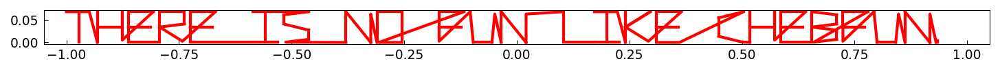
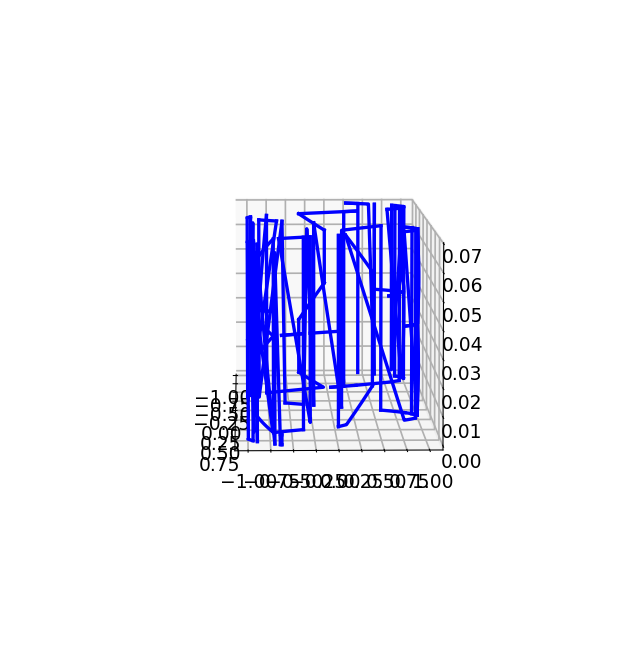
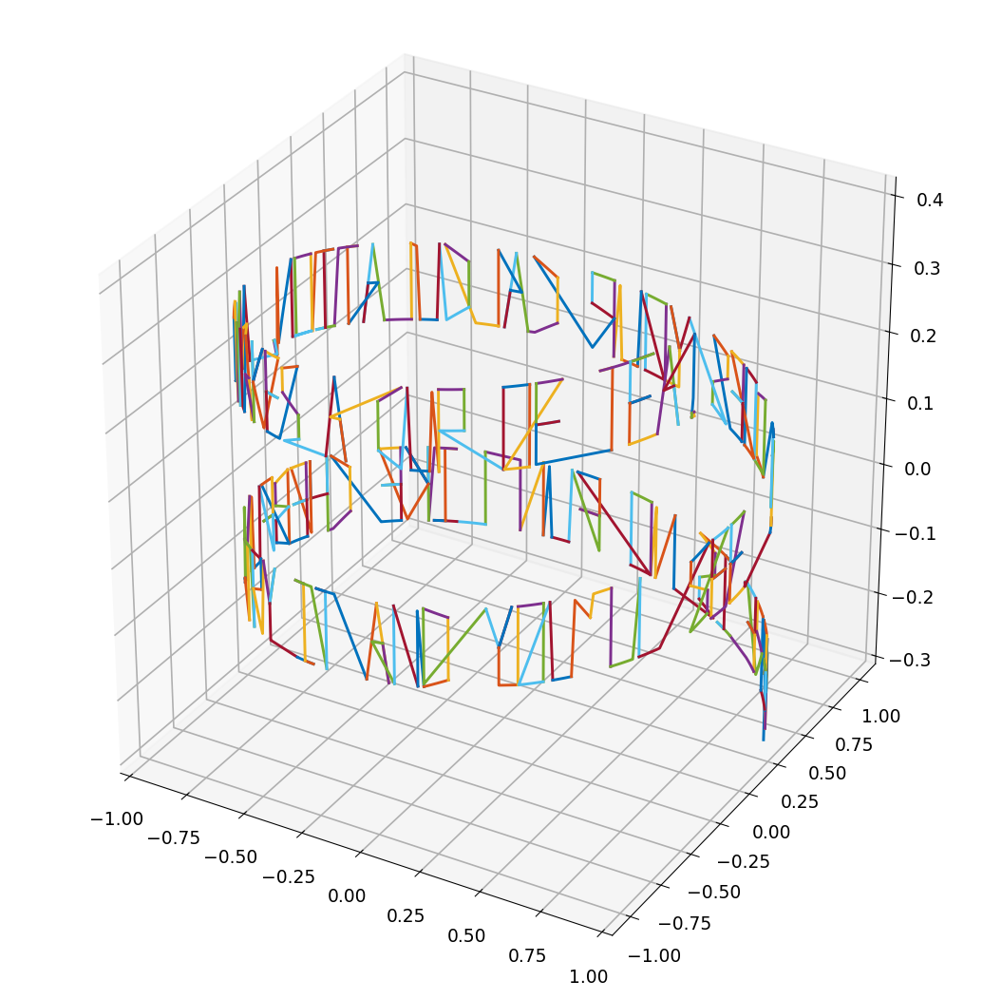

# Writing messages in 3D

*Nick Trefethen, November 2010*

[Original MATLAB Chebfun example](https://www.chebfun.org/examples/fun/Writing3D.html)

(Chebfun example fun/Writing3D.m)

`scribble` text is a complex chebfun, so it can be transformed at
will — flat:

bent along a sine wave in 3D:

or wrapped around a cylinder:

---

*Replicated with [chebfunjax](https://github.com/ma-gilles/chebfunjax); original
example copyright The University of Oxford and The Chebfun Developers.*
