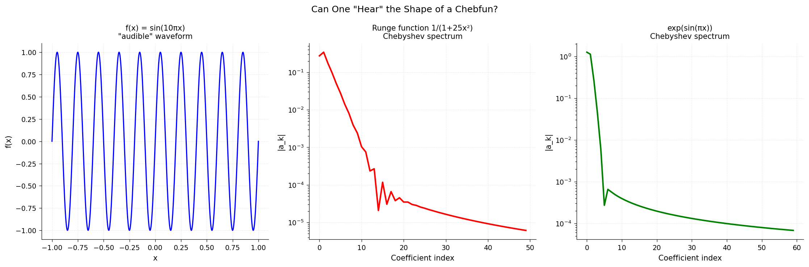

# Can One Hear the Shape of a Chebfun?

**Original:** [fun/AudibleChebfuns](https://github.com/chebfun/examples/blob/master/fun/AudibleChebfuns.m)
**Author(s):** Stefan Guttel, November 2011

---

The `chebtune` function turns chebfuns into melodies. It works by sampling a
chebfun at sufficiently many equispaced points on its domain and varying the
pitch of the melody according to the real part of the samples. The function
value $0$ is associated with the tone c'' and the integers below and above
correspond to the semitones. A second argument adjusts the duration.

## Chromatic scale

A chromatic tone progression over one octave, played for 6 seconds, can be
encoded as a piecewise-constant chebfun on $[0, 13]$:

$$y(x) = \lfloor x \rfloor, \quad x \in [0, 13].$$

The twelve steps map to the pitches c, c#, d, d#, e, f, f#, g, g#, a, a#, b, c.

## Chords and morphing

The `chebtune` function can also play chords when a quasimatrix argument is
provided. For example, a C major chord continuously morphed to an E minor chord
is given by three smooth columns:

$$Y(x) = \bigl[\, 0 + 4x^2,\; 4 + 3x^2,\; 7 + 4x^2 \,\bigr], \quad x \in [0,1].$$

## Whistle and police car

A whistle sound is produced by a smooth function with high-frequency oscillation
added to avoid a pure-sine quality, with NaN values masking silent regions at the
start and end. A police-car siren is described by a two-column quasimatrix:

$$Y(x) = \bigl[\, 9 + 6\sin(46x),\; 7 + 10\sin(4x) \,\bigr], \quad x \in [-1,1].$$

## Accessibility

The author raises the question of whether `chebtune` could be useful for
vision-impaired users of Chebfun. A person with a trained ear should be able to
tell roughly the shape of a function by listening, and with the reference tone
c'' one can also hear the number of roots.

## Code

```python
from examples.fun.audible_chebfuns import run
run()
```


<<<<<<< HEAD

## References

1. `chebtune.m` source: <http://github.com/chebfun/chebfun/blob/master/%40chebfun/chebtune.m>
2. Audio output files: <http://www2.maths.ox.ac.uk/chebfun/examples/fun/audio/>
=======
>>>>>>> origin/main