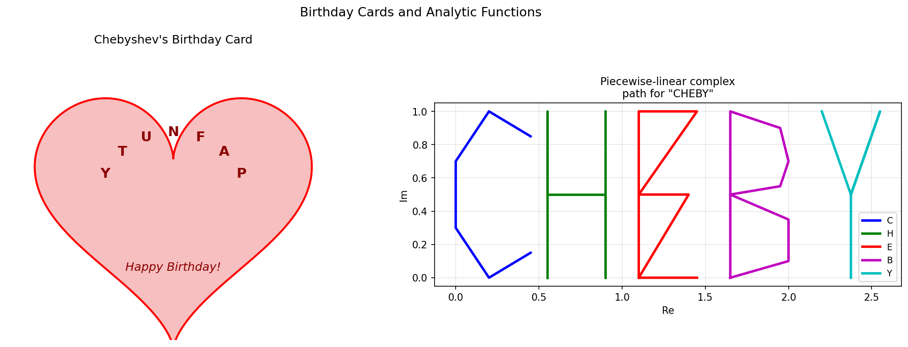

# Birthday Cards and Analytic Functions

**Original:** [fun/Birthday](https://www.chebfun.org/examples/fun/Birthday.html)
**Author:** Nick Trefethen, September 2010

---

Chebfun's `scribble` command was introduced for entertainment, but it turns
out to be surprisingly useful for illustrating complex variables. Suppose
for example it is Chebyshev's birthday and you want to send him a card.

In this translation, we draw Chebyshev's birthday card using a heart shape
and letter strokes encoded as piecewise-linear complex paths.

## Piecewise-linear complex path

A letter written in the complex plane is a piecewise-linear function
of a real parameter $t \in [-1,1]$:

$$s(t) = \sum_k \mathbf{1}_{[t_k, t_{k+1}]}(t) \left[(1-\tau) z_k + \tau z_{k+1}\right]$$

where $\tau = (t - t_k)/(t_{k+1} - t_k)$ and $z_k$ are the breakpoints.

## Code

```python
from examples.fun.birthday import run
run()
```

## Output



The left panel shows a heart-shaped card with "PAFNUTY" (Chebyshev's first name)
written in an arc. The right panel shows "CHEBY" encoded as piecewise-linear
strokes in the complex plane.
