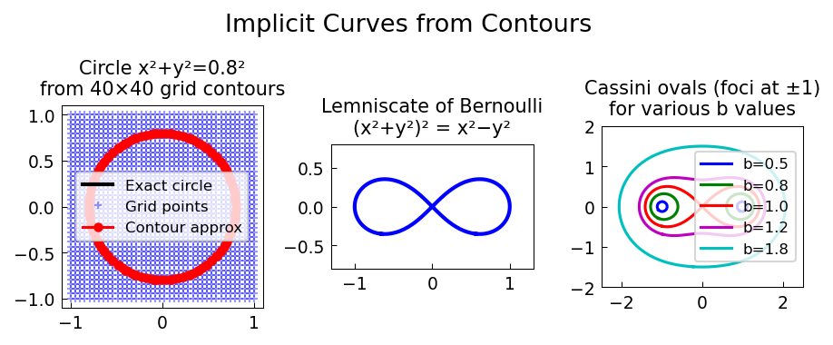

# Implicit Functions and Fun with Contours

**Original:** [fun/ContourFun](https://github.com/chebfun/examples/blob/master/fun/ContourFun.m)
**Author(s):** Stefan Guttel, July 2012

---

MATLAB's `contours` function returns points on level lines of a matrix, and
this can be used to define chebfuns satisfying an implicit equation $z(x,y)=0$
-- at least approximately. This example demonstrates the technique on several
geometric curves and even on a photograph.

## A circle from a contour

Suppose we want a chebfun for a circle of radius 0.8 centred at the origin.
The points on this circle satisfy

$$z(x,y) = x^2 + y^2 - 0.64 = 0.$$

Sampling $z$ at $20 \times 20$ grid points on $[-1,1]^2$ and extracting the
zero-level contour gives a set of points that interpolate between the grid
values. Converting these coordinates to a complex-valued chebfun produces a
smooth parametric curve that approximates the circle.

## Curves from an image

The technique extends naturally to images. A photograph of a whiteboard
(taken by Yuji Nakatsukasa) is converted to grayscale and cropped to a region
of interest. Contour extraction at a suitable brightness level produces pairs
of chebfuns corresponding to the upper and lower edges of each drawn line.
Averaging the two edges recovers the centreline of the hand-drawn curve.

Since these are chebfuns, standard Chebfun operations apply: the enclosed area
can be computed, a best polynomial approximation of degree 3 can be overlaid,
and the intersections of the approximation with the original curve can be found
via root-finding.

## Is the curve a circle?

The area and centroid of a closed curve in the plane can be computed from the
standard complex-variable formulas

$$\text{Area} = \int \operatorname{Re}(f)\,d\!\operatorname{Im}(f), \qquad
\text{centroid} = \frac{1}{2i\,\text{Area}}\int f\,\bar{f}\,df.$$

Drawing a perfect circle with the same area for comparison shows how close the
hand-drawn shape is to circular.

## Self-portrait

Finally, the image of a person is decomposed into contour quasimatrices at
three brightness levels (0.2, 0.4, 0.8), producing a stylised
chebfun-portrait rendered in shades of grey.




1. Chebfun Example [geom/Area](../geom/area_centroid.md)

## Code

```python
from examples.fun.contour_fun import run
run()
```


## References
