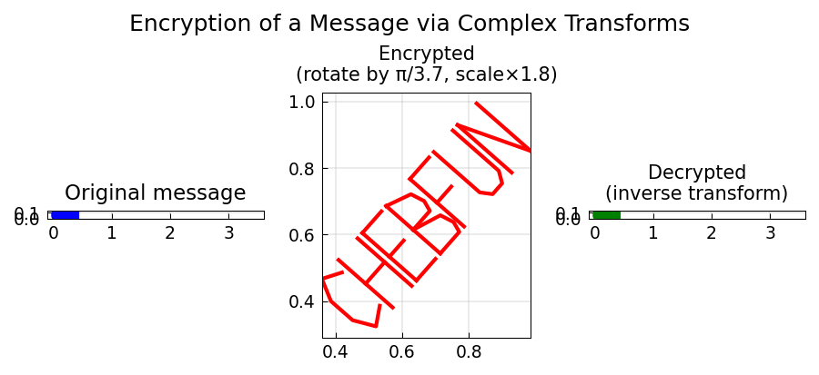

# Encryption of a Message

**Original:** [fun/Encryption](https://www.chebfun.org/examples/fun/Encryption.html)
**Author(s):** Nick Trefethen, April 2012

---

The `scribble` command produces piecewise-linear complex chebfuns whose plots
look like words. This example demonstrates what is cheerfully described as
"the world's most expensive and least secure method of encryption."

## The encryption scheme

Two text strings are converted to chebfuns via `scribble`:

- **message**: the text to be hidden, e.g. "This is the message"
- **key**: an arbitrary key string, e.g. "Aardvarks eat ants"

Since both are complex-valued chebfuns on $[-1,1]$, their sum

$$\text{encrypted}(t) = \text{message}(t) + \text{key}(t)$$

produces a jumble of strokes that is visually unreadable. The original message
is recovered by simple subtraction:

$$\text{message}(t) = \text{encrypted}(t) - \text{key}(t).$$

## Scrambling in the complex plane

For additional obfuscation, the encrypted chebfun can be transformed by a
complex exponential:

$$\text{scrambled}(t) = \exp\!\bigl(1.5i \cdot \text{encrypted}(t)\bigr).$$

Recovery requires unwrapping the complex logarithm:

$$\text{message}(t) = \frac{\operatorname{unwrap}\!\bigl(\log(\text{scrambled}(t))\bigr)}{1.5i} - 1 - \text{key}(t).$$

This turns the already-garbled strokes into a tightly wound pattern in the
complex plane -- one that no human eye could decipher, but that Chebfun
reverses effortlessly.

## Code

```python
from examples.fun.encryption import run
run()
```

## Output


