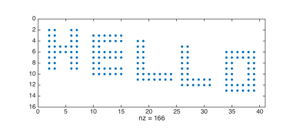
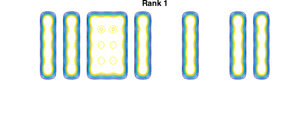
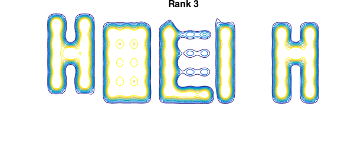
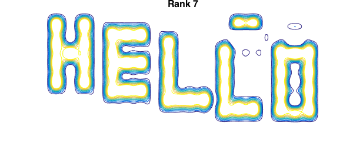
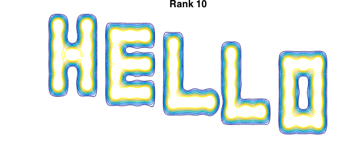

<!-- Generated by scripts/sync_chebfun_examples.py. -->
<!-- Source: https://www.chebfun.org/examples/fun/HelloWorld.html -->

<h1>Hello World</h1>
<h2>Alex Townsend, March 2013 in <a href='../'>fun</a><a href='/examples/fun/HelloWorld.m'>download</a>&middot;<a href='//github.com/chebfun/examples/blob/master/fun/HelloWorld.m'>view on GitHub</a></h2>

In any programming language printing "Hello World" is always a first example.  Here we display "Hello" using Chebfun2. Can you adapt it to display "Hello World" instead?

Here is a matrix that encodes the word "Hello", from Exercise 9.3 of [1].

<pre class="mcode-input">A=zeros(15,40);
A(2:9,2:3)=1; A(5:6,4:5)=1;A(2:9,6:7)=1; A(3:10,10:11)=1;
A(3:4,10:15)=1; A(6:7,10:15)=1; A(9:10,10:15)=1; A(4:11,18:19)=1;
A(10:11,18:24)=1; A(5:12,26:27)=1; A(11:12,26:31)=1;
A(6:13,34:35)=1; A(6:13,38:39)=1; A(6:7,36:37)=1; A(12:13,36:37)=1;
spy(A)</pre>

The matrix is of size $15\times 40$ and hence of rank at most 15. Actually it is of rank 10 because there are five zero rows:

<pre class="mcode-input">rank(A)</pre>

<pre class="mcode-output">ans =
    10
</pre>

<h3 id="constructing-a-chebfun2-from-discrete-data">Constructing a chebfun2 from discrete data</h3>

Usually Chebfun2 is passed a function of two variables, but it can also deal with discrete data such as a matrix, with syntax such as <code>chebfun2(A)</code>. The matrix $A$, of size $m\times n$, is assumed to contain data values of a function sampled on an $m\times n$ Chebyshev tensor grid, and the resulting chebfun2 interpolates $A$.  For example:

<pre class="mcode-input">f = chebfun2(A);           % chebfun2
X = chebpolyval2(f);       % evaluate on a grid
norm(A - X)                % interpolation error</pre>

<pre class="mcode-output">ans =
     2.657492966402851e-15
</pre>

<h3 id="saying-hello">Saying Hello</h3>

We can also pass the Chebfun2 constructor an integer $k$ so that the resulting chebfun2 is of rank exactly $k$. Here is one way to say "Hello":

<pre class="mcode-input">m = 200;
x = linspace(-1,1,m);
[xx yy]=meshgrid(x);
[ss tt]=chebfun2.chebpts2(m);

B = flipud(A);             % flip because of matrix indexing
for k = [1 3 5 7 10]
    f = chebfun2(B,k);
    X = f(ss,tt);
    contour(xx,yy,X,.1:.1:.99), axis off
    title(sprintf('Rank %u',k),'fontsize',16)
    pause(.1)
    snapnow
end</pre>

<h3 id="references">References</h3>
<ol>
<li>L. N. Trefethen and D. Bau III, <em>Numerical Linear Algebra</em>, SIAM, 1997.</li>
</ol>

        

    

    

        
&copy; Copyright 2025 the University of Oxford and the Chebfun Developers.

        
    

    
    
    
    
    
    
    
    
  </body>
</html>

