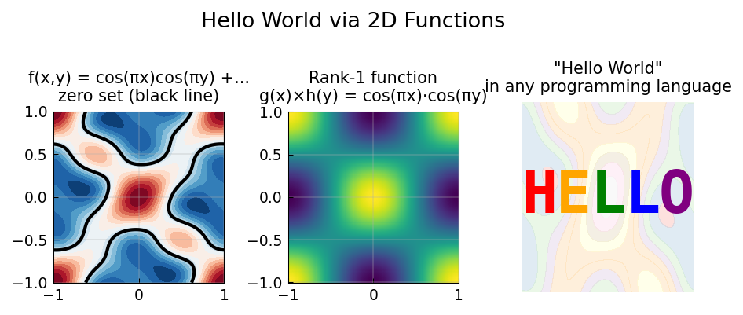

# Hello World

**Original:** [fun/HelloWorld](https://www.chebfun.org/examples/fun/HelloWorld.html)
**Author(s):** Alex Townsend, March 2013

---

In any programming language, printing "Hello World" is always a first example.
Here we display "HELLO" using Chebfun2, demonstrating how low-rank bivariate
functions can encode text.

## A matrix encoding of HELLO

A $15 \times 40$ binary matrix $A$ encodes the five letters of "HELLO" as
blocks of ones on a zero background (from Exercise 9.3 of [1]). The matrix
has rank 10 because five of its rows are entirely zero.

## Constructing a chebfun2 from discrete data

Usually Chebfun2 is passed a function of two variables, but it can also deal
with discrete data. The matrix $A$, of size $m \times n$, is assumed to contain
data sampled on an $m \times n$ Chebyshev tensor grid, and the resulting
chebfun2 interpolates $A$:

$$f = \text{chebfun2}(A), \qquad \|A - f(\text{chebpts})\| \approx 0.$$

## Saying Hello at different ranks

The Chebfun2 constructor can also be given an integer $k$ so that the
resulting object has rank exactly $k$. Contour plots of the rank-$k$
approximations for $k = 1, 3, 5, 7, 10$ show the word "HELLO" emerging
from blurry blobs into sharp lettering as the rank increases.




1. L. N. Trefethen and D. Bau III, *Numerical Linear Algebra*, SIAM, 1997.

## Code

```python
from examples.fun.hello_world import run
run()
```


## References
