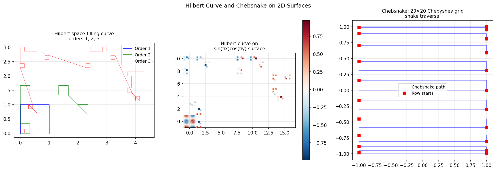

# Hilbert Curve and Chebsnake

**Original:** [fun/HilbertSurfaceChebsnake2](https://www.chebfun.org/examples/fun/HilbertSurfaceChebsnake2.html)
**Author(s):** Georges Klein, March 2013

---

Plots the Hilbert space-filling curve and a Chebsnake traversal of a Chebyshev grid on a 2D surface.

## Code

```python
from examples.fun.hilbert_surface_chebsnake import run
run()
```

## Output


