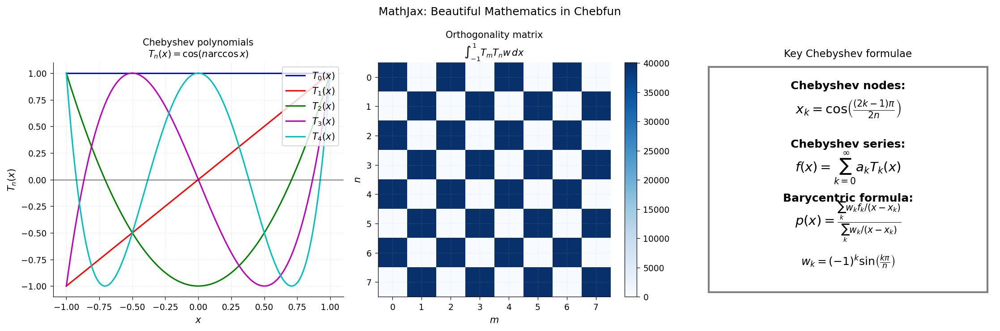

# MathJax Introduction

**Original:** [fun/MathJax](https://github.com/chebfun/examples/blob/master/fun/MathJax.m)
**Author(s):** Nick Hale, March 2012

---

This example was created to celebrate the introduction of LaTeX equation
rendering via MathJax in the Chebfun Examples collection.

## MathJax and mathematics on the web

MathJax is an open-source JavaScript display engine for mathematics that
works in all modern browsers. With its support, Chebfun Examples can include
properly typeset mathematical formulas.

## A classic formula

When $a \ne 0$, there are two solutions to $ax^2 + bx + c = 0$ and they are

$$x = \frac{-b \pm \sqrt{b^2 - 4ac}}{2a}.$$

## The visualization

The example renders the text "MathJax is cool!" using Chebfun's `scribble`
command, then applies the complex exponential $\exp(3i \cdot s)$ to wrap
the letters into a circular pattern -- a playful demonstration that Chebfun
and MathJax are both tools for making mathematics beautiful.




## Code

```python
from examples.fun.mathjax import run
run()
```
