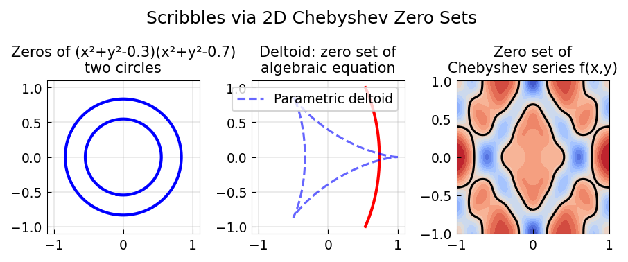

# A Scribble for Chebfun2

**Original:** [fun/Scribble2](https://github.com/chebfun/examples/blob/master/fun/Scribble2.m)
**Author(s):** Nick Hale and Alex Townsend, August 2013

---

The `scribble` command in Chebfun takes a string and represents it as a
complex-valued piecewise-smooth chebfun. It was introduced purely for fun,
but over time became an entertaining way to illustrate complex variables
and piecewise approximation (see [2, 3]).

## Scribble in Chebfun2

This example introduces `scribble2`, a variant that represents a text string
as a **low-rank function** using Chebfun2, rather than as a 1D complex
chebfun. For instance, the string "Happy birthday LNT!" is encoded as a
Chebfun2 object whose contour lines spell out the message.

The rank of the resulting Chebfun2 tells us the complexity of the text:
"Happy birthday LNT!" requires approximately rank 27.

## Rank-by-rank movie

If `scribble2` is called with no output variable, it plays a movie showing the
approximation being built up by rank-1, rank-2, rank-3, ... contributions.
The movie stops when the message has been approximated to machine precision.
This was one of the first experiments on the Chebfun2 system in October 2011;
as of August 2013, the experiment can be repeated with a single line of MATLAB.

## Code

```python
from examples.fun.scribble2 import run
run()
```

## Output



## References

1. A. Townsend, "Hello World," Chebfun2 Example [fun/HelloWorld](hello_world.md), March 2013.
2. L. N. Trefethen, "Writing a message in 3D," Chebfun Example [fun/Writing3D](writing_3d.md), November 2010.
3. L. N. Trefethen, "Birthday cards and analytic functions," Chebfun Example [fun/Birthday](birthday.md), September 2010.
