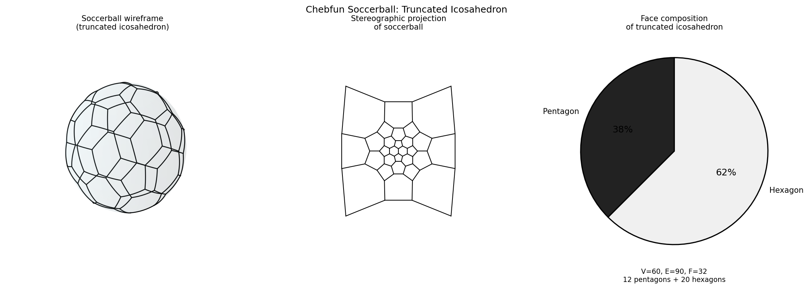

# Chebfun Soccerball

**Original:** [fun/SoccerBall](https://github.com/chebfun/examples/blob/master/fun/SoccerBall.m)
**Author(s):** Filomena Di Tommaso, July 2013

---

The aim of this example is to draw a soccerball -- a truncated icosahedron --
using Chebfun2 for the spherical surface and Chebfun for the edge curves.

## The truncated icosahedron

The vertices of a soccerball are the vertices of a truncated icosahedron
centred at the origin. They are all even permutations of

$$\begin{aligned}
& (0, \pm 1, \pm 3\varphi), \\
& (\pm 2, \pm(1+2\varphi), \pm\varphi), \\
& (\pm 1, \pm(2+\varphi), \pm 2\varphi),
\end{aligned}$$

where $\varphi = (1+\sqrt{5})/2$ is the golden ratio [1]. This gives 60
vertices in total, which define 20 hexagonal and 12 pentagonal faces.

## Drawing the edges

The sphere has radius $r = \sqrt{9\varphi + 10}$ and is rendered as a
parametric surface using Chebfun2. Each edge of the soccerball lies on a
great circle, so connecting two vertices requires computing the plane through
the two vertices and the origin, then parameterising the resulting arc.

Three cases arise:

- **Parallel edges**: two vertices share the same $z$-coordinate, so the edge
  is an arc on a circle of latitude.
- **Meridional edges**: two vertices share the same azimuthal angle.
- **Slanted edges**: the general case, handled by computing the intersection
  of the vertex plane with the sphere.

The North and South pole hexagons are treated as special cases.

## Colouring the pentagonal faces

To colour the pentagons black, each pentagonal face is subdivided into three
triangles. For a grid of candidate points, **spherical barycentric
coordinates** [2] determine whether each point lies inside the pentagon
(all three coordinates non-negative). Antipodal symmetry halves the work.

## Code

```python
from examples.fun.soccer_ball import run
run()
```



## References

1. <http://en.wikipedia.org/wiki/Truncated_icosahedron>
2. C. Funfzig, *Spherical techniques and their applications in a scene graph
   system*, University of Braunschweig (2007), ISBN 978-3-86727-111-0.