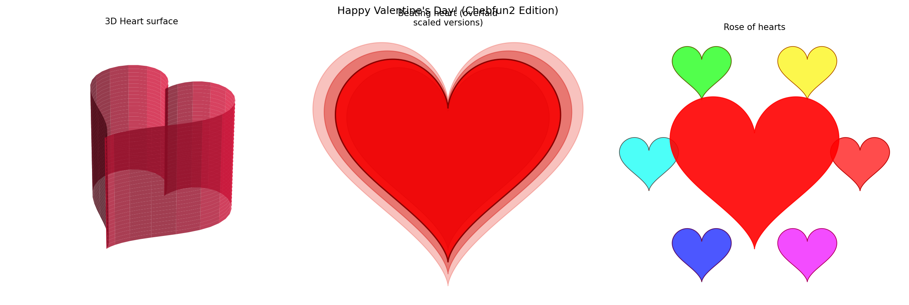

# Happy Valentine's Day! (again)

**Original:** [fun/ValentinesDay2](https://www.chebfun.org/examples/fun/ValentinesDay2.html)
**Author(s):** Anonymous, February 2013

---

Happy Valentine's Day to all Chebfun2 users! This example constructs a 3D
heart-shaped surface, wraps a greeting message around it, and produces a
rotating animation.

## Parametric heart surface

The heart is defined as a parametric surface using Chebfun2, with parameters
$t \in [0,1]$ and $\theta \in [0, 4\pi]$:

$$X = \sin(\pi t)\cos(\theta/2),$$
$$Y = 0.7\,\sin(\pi t)\sin(\theta/2),$$
$$Z = \frac{(t-1)(-49 + 50t + 30t\cos\theta + \cos 2\theta)}{-25 + \cos^2\theta}.$$

## Colour scheme and message

A colour map is defined by

$$C = \sin(10X)\cos\!\bigl((Y-0.1)^2\bigr) + (Z+1),$$

giving warm tones when rendered with a "hot" colourmap.

The text "Happy Valentines Day!" is created using `scribble` and mapped onto
the 3D surface via `plot3`, wrapping the message around the heart.

## Rotating animation

The view angle is swept from $-1.25$ to $3$ (in multiples of $180^\circ$)
while keeping the elevation fixed at $6^\circ$, producing a smooth rotation
that reveals the heart from all sides. The animation can optionally be saved
as a GIF.




1. Anonymous, "Happy Valentine's Day!," Chebfun Example [fun/ValentinesDay](https://www.chebfun.org/examples/fun/ValentinesDay.html), February 2013.

## Code

```python
from examples.fun.valentines_day2 import run
run()
```


## References
