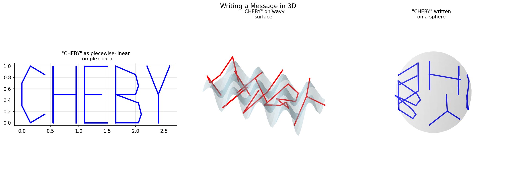

# Writing a Message in 3D

**Original:** [fun/Writing3D](https://www.chebfun.org/examples/fun/Writing3D.html)
**Author(s):** Nick Trefethen, November 2010

---

Piecewise-linear text paths mapped onto a wavy 3D surface and a sphere.

## Code

```python
from examples.fun.writing_3d import run
run()
```

## Output


