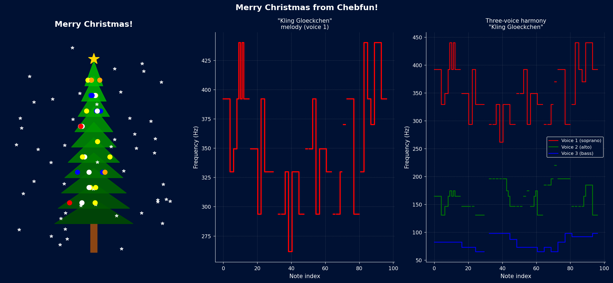

# Merry Christmas!

**Original:** [fun/XmasCard](https://github.com/chebfun/examples/blob/master/fun/XmasCard.m)
**Author(s):** Stefan Guttel and Nick Hale, December 2011

---

Chebfun has long been a popular medium for sending birthday wishes [1], and
this example extends the tradition to Christmas greetings -- complete with
a melody, falling snowflakes, and a seasonal message.

## The melody: Kling Gloeckchen

The German Christmas carol "Kling Gloeckchen, klingelingeling" is encoded as
three voices (melody, harmony, bass) using strings of hexadecimal characters.
Each character maps to a semitone value: `'0'` = c, `'1'` = c#, ...,
`'9'` = a, `'a'` = a#, ..., `'f'` = e', and `'-'` indicates a rest (NaN).

A helper function `str2tune` converts each voice string into a
piecewise-constant chebfun. The three voices are assembled into a
quasimatrix, with the harmony shifted down one octave and the bass shifted
down two octaves. A slight detuning ($\pm 0.09$ semitones) is applied to the
melody to create a chorus effect.

The quasimatrix is passed to `chebtune`, which converts it to an audio
waveform.

## The graphics

The text "Merry Xmas!" is drawn using `scribble` and displayed in red. Blue
star markers are scattered at random positions in the $[-1,1]^2$ square and
animated as falling snowflakes: at each frame, small random horizontal
perturbations and a downward drift are applied. Stars that leave the frame
are respawned at the top.

## Code

```python
from examples.fun.xmas_card import run
run()
```

## Output



## References

1. Chebfun Example [fun/Birthday](birthday.md)
2. Chebfun Example [fun/AudibleChebfuns](audible_chebfuns.md)
