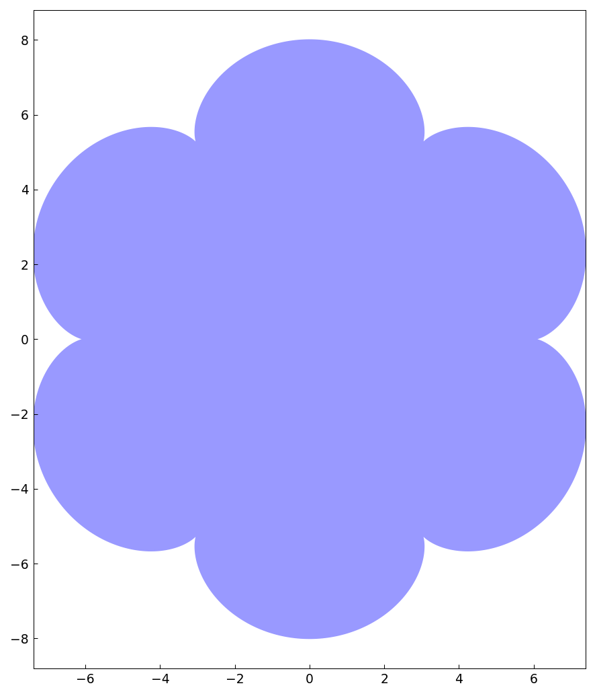
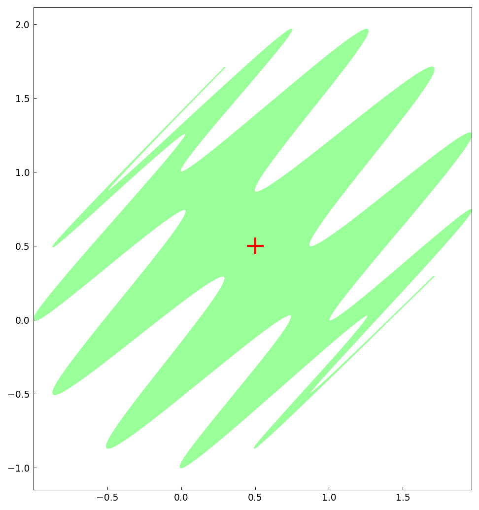

# Areas and centroids of planar regions

*Stefan Guettel, October 2011*

[Original MATLAB Chebfun example](https://www.chebfun.org/examples/geom/Area.html)

(Chebfun example geom/Area.m)

Green's theorem turns the area enclosed by a parametrized curve into
a 1D chebfun integral, $A = \oint x\,dy$.  For an epicycloid with
$m = 7$ cusps:



```text
A =
     1.759291886010285e+02
exact =
     1.759291886010284e+02
```

For a wiggly complex curve $z(t) = e^{it} + (1+i)\sin^2 6t$
(which encloses the same area as the unit circle):

```text
ans =
   3.141592653589794
   3.141592653589793
```

The centroid comes from another contour integral,
$c = \oint z\bar z\,dz / 2iA$ — landing exactly at
$(1/2, 1/2)$:



(All values digit-for-digit with the published MATLAB run.)

---

*Replicated with [chebfunjax](https://github.com/ma-gilles/chebfunjax); original
example copyright The University of Oxford and The Chebfun Developers.*
